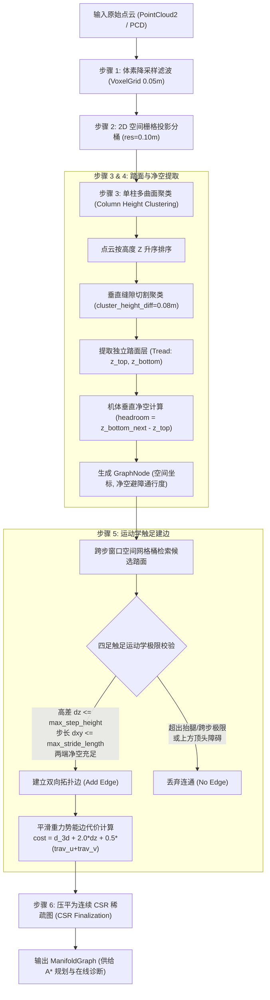
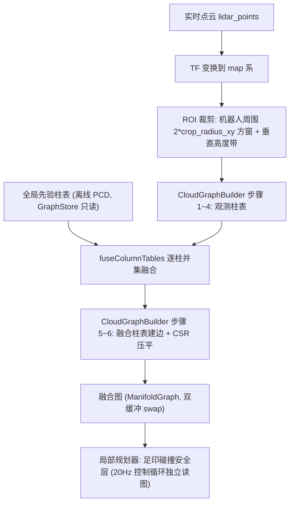

# Elevation Nav: 基于多层流形高程图的三维跨层导航系统

本项目面向四足机器人等具有离散立体跨越能力的移动底盘，提供一套从**三维点云处理、多层流形拓扑建图、全局跨层 A\* 规划**到**局部控制与 Web 3D 交互**的完整导航方案。

---

## 一、三维建图完整流程 (Point Cloud to Topology Graph)

系统通过 `elevation_planner_core` 中的 `CloudGraphBuilder` 模块，将原始三维激光点云端到端转化为紧凑的跨层拓扑流形图，全流程如下：



---

### 建图各步骤详细解析

#### 步骤 1：体素降采样滤波 (VoxelGrid Downsampling)
* **目的**：原始激光雷达点云分布极不均匀（近处每平方分米包含成千上万点，远处极稀疏），直接遍历运算开销极大。
* **机制**：将三维空间划分为 $0.05\text{m} \times 0.05\text{m} \times 0.05\text{m}$ 的立体小盒子（体素）。落在同一体素内的所有激光点取重心均值合并为一个代表点。
* **效果**：将海量无序点云压缩至均匀分布，滤除高频杂波，使建图速度提升数十倍。

#### 步骤 2：2D 空间栅格投影分桶 (Spatial Column Binning)
* **目的**：将连续的三维散点按水平位置归纳，便于空间近邻快速索引。
* **机制**：以平面分辨率（默认 $0.10\text{m}$）构建二维网格，相当于在每个网格上立起一根截面为 $0.10\text{m} \times 0.10\text{m}$、垂直延伸的空心柱子（Column）。算法遍历降采样后的点，通过 $O(N)$ 一次哈希直接归入对应的垂直柱子桶 `column_heights[r, c]`。
* **效果**：同一柱子内的所有点水平坐标 $(x, y)$ 聚集在格内，仅在垂直高度 $z$ 上存在差异。

#### 步骤 3：单柱多曲面聚类 (Vertical Column Multi-Surface Clustering) —— 核心步骤
* **目的**：突破传统 2.5D 高程图（每个网格只能存一个高度）无法表达多层立体重叠地形的痛点。在一根垂直柱子内，激光可能同时穿透地下室、一层地面、桌板、二层地面或天花板。
* **机制**：
  1. **高度排序**：将当前柱内的所有点云按高度 $z$ 升序排列：$z_0 \le z_1 \le z_2 \le \dots$
  2. **垂直缝隙切割 (`cluster_height_diff = 0.08m`)**：从最低点向上扫描相邻两点间距 $\Delta z = z_k - z_{k-1}$。若 $\Delta z \le 0.08\text{m}$，视为同一个平面的表面厚度；若 $\Delta z > 0.08\text{m}$，说明两层之间悬空断开，算法立即切割，结算当前表面并开启全新的一层。
  3. **噪点过滤 (`min_cluster_points = 2`)**：单层必须包含至少 2 个点，过滤悬空杂点。
* **效果**：一根垂直柱子被精准分解为多层独立的水平支撑面（`RawSurface`），每一层记录该平面的底高度 $z_{\text{bottom}}$ 与踩踏高度 $z_{\text{top}}$。

#### 步骤 4：踏面节点生成与机体垂直净空计算 (GraphNode & Headroom)
* **踏面（Tread）定义**：四足机器狗足端实际接触、能提供稳定法向支撑力的水平面（取当前层的最高点 $z_{\text{top}}$ 作为落足高程）。
* **净空（Headroom）定义**：当前踏面正上方到上层结构底板的垂直通过高度。机器狗站立行走具有物理高度（$dog\_height = 0.45\text{m}$），即使地面平坦，上方若过低也会发生顶头碰撞。
* **计算原理**：
  ```
         ▲ Z 轴 (垂直高度)
         │
         │    [ 上层楼板 / 天花板底面 ]   z_bottom_next
         │    -----------------------------------------
         │                        ▲
         │                        │  净空 (headroom) = z_bottom_next - z_top
         │                        │  (判断 headroom >= dog_height)
         │                        ▼
         │    -----------------------------------------
         │    [ 本层踏面 (落脚支撑面) ]   z_top
  ───────┴─────────────────────────────────────────────► 水平平面
  ```
  - 若上方开阔无遮挡，净空设为充分大（$3.0\text{m}$）；
  - 若上方存在上一层结构，$\text{headroom} = z_{\text{bottom, next}} - z_{\text{top}}$；
  - 若 $\text{headroom} < dog\_height$，标记为避障阻挡节点（`traversability = 1.0`），A\* 规划器绝不规划该空间。

#### 步骤 5：两遍式建边——短边主干 + 跨步窗口按需架桥 (Sparse Backbone + On-demand Bridging)
* **目的**：判定相邻两个空间踏面节点之间，四足机器人能否安全迈出一步，同时保持图稀疏。
* **机制**：
  **第一遍（短边主干）**：遍历节点 $u$，仅对 8 邻接格内的候选 $v$ 校验运动学极限（抬腿高差 $|u.z - v.z| \le \text{max\_step\_height}$、机体胶囊扫掠无碰撞），建立连通性主干。
  **第二遍（长边按需架桥）**：在半径 $R = \lceil \text{max\_stride\_length} / \text{resolution} \rceil$（默认 4 格）的跨步窗口内枚举长边候选，但**仅当两端经并查集判定尚不连通时才架设**——长边只出现在短边链无法连通的位置（相邻格高差锯齿、点云局部缺失、窄缝两侧），平地冗余直连边被完全消除。长边额外校验：水平跨步 $\le \text{max\_stride\_length}$（窗口由该极限反推，使参数真实生效）、途经每个栅格必须有通行高度带内的可通行节点（防止借桥跨楼梯井/空洞）、胶囊扫掠无剐蹭。
* **效果**：不论台阶视角是 50°、60° 还是 70°，只要在抬腿与步长极限内拓扑即连通；悬崖、过高断坎与超宽沟壑被自然隔断。图规模与 8 邻域方案相当，但保留了跨步极限的真实表达能力。

#### 步骤 6：压平为连续 CSR 稀疏图 (CSR Finalization)
* **目的**：解决建图过程中动态链表/向量内存分散、缓存命中率低的性能问题。
* **机制**：将所有节点的邻接边紧凑平铺至连续内存数组（Compressed Sparse Row）。每个节点仅保存起始边下标偏移（`edge_offset`）和邻接边计数（`edge_count`）。
* **效果**：A\* 算法遍历邻居节点时达到近乎 100% 的 CPU L1/L2 Cache 命中率，在数万节点的立体大图上实现 $5 \sim 10\text{ms}$ 内极速出解。

---

## 二、核心算法特点与物理内涵

### 1. 拓扑连通性（Connectivity）的物理本质

在轮式/履带式 2D/2.5D 导航中，“坡度”是决定通过性的核心，因为轮子依赖连续接触面，坡度过陡会托底滑脱。

**四足机器人属于离散触足机构（Discrete Foothold Mechanism）**，拓扑连通性的定义在本项目中回归其运动学第一性原理：

* **边代表腿部运动学工作空间包络（Kinematic Workspace）**：
  两点 $u$ 和 $v$ 之间能否建边，仅取决于机器狗能否将腿抬到该高度、跨到该距离。
* **消除经验连线角度截断**：
  建筑楼梯的踢面（Riser）通常呈垂直 $90^\circ$，相邻网格连线计算 $\arctan(\Delta z / \Delta xy)$ 会产生 $55^\circ \sim 70^\circ$ 的假象坡度。本项目移除了边倾角二值硬截断，只要高度差和跨度在物理极限内，两级踏面之间即视为完全连通。

### 2. 平滑重力做功代价模型（Soft Penalty vs Hard Cut）

取消边的硬截断并不意味着系统不加区分。系统在 A\* 代价函数中引入基于物理能耗与运动风险的平滑惩罚：

$$\text{cost} = \underbrace{\sqrt{\Delta xy^2 + \Delta z^2}}_{\text{项 1：3D 真实几何位移}} + \underbrace{w_z \cdot \Delta z}_{\text{项 2：重力势能做功惩罚}} + \underbrace{\frac{1}{2}(trav_u + trav_v)}_{\text{项 3：踏面粗糙度代价}}$$

#### (1) 公式物理含义拆解
* **项 1（3D 空间位移）**：机器狗质心在空间中行进的真实欧氏距离，位移越长基础代价越大。
* **项 2（重力势能做功惩罚，核心机制）**：
  * **物理现实**：四足机器狗在平地上行走阻力较小，但**每上一级台阶或爬坡，腿部关节电机必须持续对抗重力做功（$W = m g \Delta z$）**。垂直爬高能耗剧增、关节易过热，且跨步动态失稳风险远高于平地。
  * **参数内涵 ($w_z = 2.0$)**：相当于在算法中定量标定——**“垂直爬高 1 米所消耗的能量与失稳风险，等价于在平地上多跑 2 米”**。高差 $\Delta z$ 越大，该边的通行代价呈线性递增。
* **项 3（踏面粗糙度）**：结合网格表面特征，越颠簸的踏面增加额外的通行阻尼。

#### (2) 为什么称为“平滑（Smooth）”？对比传统硬截断
* **传统硬截断的缺陷**：
  传统方法常使用类似 `if (slope > 30.0°) continue;` 的生硬分支。这在数学上构成**阶跃断崖**（29.9° 允许通行，30.1° 立即判定为绝路），面对 50°~70° 的建筑楼梯时全图直接断连，导致 A\* 报出 `No path found` 规划失败。
* **平滑代价的优势**：
  不切断拓扑连通，将代价函数设计为关于垂直高差 $\Delta z$ **连续可导的平滑线性函数**：
  * 走平地（$\Delta z = 0$）：势能附加代价为 0，代价最低；
  * 走缓坡（$\Delta z = 0.03\text{m}$）：代价微量递增；
  * 爬台阶（$\Delta z = 0.15\text{m}$）：平滑累加势能惩罚 $2.0 \times 0.15 = 0.3$。
  全流程无任何经验魔法角度，数学模型连续严谨。

#### (3) 在全局路径搜索中的双重自主决策表现
A\* 算法的本质是寻找全图**总代价最小（Cost 最低）**的路径，平滑势能代价使规划器具备了自适应决策能力：
1. **有平路时自主绕行（优先平路）**：
   若终点可以通过走廊平缓绕行，也可以直接爬一段陡楼梯。虽然爬楼梯几何位移稍短，但因重力势能项 $w_z \cdot \Delta z$ 的大幅惩罚，走平路的总代价更低，**A\* 规划器会自动优选平坦绕行通道**，避免让狗冒攀爬风险。
2. **仅有楼梯时确保连通（保证可达）**：
   若场景中无平缓通道（必须跨楼层登楼），由于楼梯在拓扑上未被 `if` 语句砍断（边完全连通），**规划器绝不会报错，而是平稳搜索出走楼梯的最优跨层路径**。

### 3. 多层流形表达（Manifold Graph）

* **超越传统 2.5D 高程图**：传统高程图为单值映射 $z = f(x, y)$，在多层连廊、高架下或立体建筑中会覆盖底层信息。
* **分层曲面拓扑**：单列支持任意数量的垂直重叠踏面，通过净空判定隔离并按三维欧氏距离和抬腿能力建立跨层边。

### 4. 机体碰撞建模（侧向足印膨胀 + 建边扫掠）

足端运动学约束（抬腿/跨步）只保证**落足点**可达，不保证**机体**不与侧向结构剐蹭——楼梯转角贴墙、对角边内切墙角是典型碰撞场景。系统在图构建阶段引入机体建模：

* **侧向障碍判据**：邻格表面若"垂直范围跨越攀爬包络"（结构底面贴近本层踏面、顶面超过 `tread_z + k * max_step_height`，k 为格距）判定为墙体/台沿类侧向障碍。攀爬包络与建边运动学口径一致：每前进一格最多再爬一级 `max_step_height`，因此连续楼梯永不跨越该包络、爬楼梯本身不会被误判；k=1（贴身）时退化为单步踏步极限线，墙体/转角防护不变。头顶楼板底面高于机体带，同样不受影响。
* **双层膨胀**：侧向障碍进入 `body_hard_radius`（半身宽+余量）内 → 节点硬阻挡；进入 `footprint_radius` 内 → 随距离衰减的软代价。A* 因此自动走走廊中线、过转角沿外侧圆滑绕行。
* **建边胶囊扫掠**：对每条边沿 $u \to v$ 线段采样，在水平方向做机体胶囊判定——硬半径内出现**本行走层**的禁行节点即丢弃该边（专治"两端自由但斜线切墙角"的转角内切）；垂直方向仅做选层过滤：只考虑**行走面高度至行走面高度 + 机体高度**内的禁行节点——身体在脚平面以上，行走面以下的点（被踩的台阶、下层楼板、矮沿）碰不到身体；与行走面同高的禁行点仍算碰撞（低顶通道以同高禁行点标记）。扫掠区触及软膨胀带时提高边代价。
* **平滑防回侵**：路径平滑器逐点回查膨胀图，平滑落点落入阻挡区（或图外空白格，防楼梯边缘悬空）即回退到原始路径点。
* **局部安全停车**：局部规划器每控制周期对当前位置做足印圆碰撞检查（足印半径内出现阻挡节点即停车），与全局膨胀共用同一套 traversability 语义。

---

## 三、功能包架构

| 模块 | 功能描述 |
| :--- | :--- |
| **`elevation_planner_core`** | 核心拓扑图定义 (`ManifoldGraph`)、点云拓扑建图器 (`CloudGraphBuilder`，含柱表生成/逐柱融合/建边压平两段式管线)、进程级共享存储 (`GraphStore`)、跨层门户 (`LayerPortal`)、代价评估器 (`CostEvaluator`) |
| **`elevation_map_loader`** | 点云加载、流形森林生成器 (`ManifoldForest`)、FastAPI 服务端与 Web 3D 可视化交互编辑器、仿真伪 TF 广播 |
| **`elevation_global_planner`** | move_base 全局规划器插件 (`ElevationGlobalPlanner`)：离线 PCD 先验建图、跨层 A* (`ManifoldAStar`)、防割角平滑 (`PathSmoother`)、在线 C++ 拓扑诊断服务 |
| **`elevation_local_planner`** | move_base 局部规划器插件 (`AStarLocalPlanner`)：基于 3D 流形拓扑图的局部 A* 动态避障寻优与前瞻平滑跟踪控制，速度指令生成 (`/cmd_vel`) |
| **`elevation_costmap`** | move_base 局部代价地图插件 (`ManifoldCostmapLayer`)：基于纯几何 1:1 地毯算法的高频局部流形代价地图生成器，零拷贝共享全局先验，供 TEB 原生消费 |

---

## 四、核心配置参数说明

| 参数名 | 默认值 | 物理含义与作用 |
| :--- | :--- | :--- |
| `resolution` | `0.10` | 2D 空间栅格投影分辨率 (m) |
| `max_step_height` | `0.25` | 四足机器人单步最大踏步高差极限 (m) |
| `max_stride_length` | `0.35` | 四足机器人单步最大水平跨步步长 (m) |
| `dog_height` | `0.45` | 机器狗通行站立高度阈值，低于此净空标记为顶头避障 (m) |
| `cluster_height_diff` | `0.08` | 垂直单柱点云聚类厚度间距，用于分离开重叠踏面 (m) |
| `min_cluster_points` | `2` | 构成有效支撑踏面所需的最小点云数 (过滤悬浮噪点与离散残影) |
| `sor_mean_k` | `16` | SOR 残影点过滤近邻统计点数 |
| `sor_std_mul` | `4` | SOR 标准差倍数阈值 (越大越保守，极大值等效关闭)。需落在表面点与真离群点的分布间隙：过小会将楼梯踏面边缘点误判为离群点整层删除 |
| `footprint_radius` | `0.24` | 机体足印外接半径 (m)，侧向障碍软代价膨胀边界，紧凑贴合机体 |
| `body_hard_radius` | `0.15` | 机体硬阻挡半径 (m)，约为半身宽 0.14m + 最小安全余量，侧向障碍进入此范围节点不可通行 |
| `sweep_penalty_weight` | `1.0` | 建边时机体扫掠区软代价权重 |
| `crop_radius_xy` | `1.5` | 实时点云融合的 ROI 滚动窗口半径 (m)，融合图边长 = 2 × crop_radius_xy |
| `crop_height_above` / `crop_height_below` | `2.0` / `1.0` | ROI 裁剪的垂直高度带：机器人脚下平面以上/以下保留范围 (m) |
| `fusion_rate` | `5.0` | 融合图刷新频率 (Hz)，与控制循环 (controller_frequency) 解耦 |
| `corridor_radius` | `3.0` | 拓扑流形管道最大展开半宽 (m)，沿连通图向外膨胀至此半径，遇悬空/断崖/不可达自然停止 |
| `cloud_topic` | `lidar_points` | 实时点云话题，融合线程的数据源 |

---

## 五、实时点云融合与 move_base 导航架构

### 1. 融合图数据流 (Live Cloud to Fused Graph)

系统在离线先验图之外，维护一张机器人周围的**滚动融合图**：实时点云只覆盖传感器当前视场（且被机体遮挡扫不到脚下），单独建图会产生"图闪烁"与脚下空洞；融合层将观测与先验逐柱合并，兼得实时性与完整性。



### 2. 逐柱并集融合规则 (fuseColumnTables)

先验柱表与观测柱表共用同一份 `GraphBuildConfig` 与栅格分辨率，节点按 `(row, col, layer)` 天然对齐。对窗口内每根柱独立合并：

1. **同一物理面**（两侧 `z_top` 差 ≤ `cluster_height_diff`）：合并为一层，几何取观测值（反映当前状态），点数取 max（一次稀疏观测不推翻先验已确认的支撑面）；
2. **仅存在于先验**：原样保留——实时雷达被机体遮挡扫不到脚下时，先验地面层仍在，脚下永远有支撑面；
3. **仅存在于观测**：新增一层（实时发现的新踏面或新障碍）；
4. **窗口最外一圈强制采用先验**：保证融合图与全局图在窗口边界处拓扑衔接。

融合**无时间衰减**：观测柱表每帧从零重建、先验柱表永不被写入，动态障碍只存在于被扫到的当帧，下帧自动消失，无需衰减参数。融合只决定"每根柱上有哪些层、每层的通行性"，**建边不融合**——融合柱表整体走同一套建边判据（短边主干 + 跨步架桥 + 胶囊扫掠）重建，保证融合图与全局图的运动学口径完全一致。

### 3. move_base 插件化架构

规划闭环统一由 move_base 调度，全局/局部均为 nav_core 插件：

| 插件 | 注册名 | 职责 |
| :--- | :--- | :--- |
| `ElevationGlobalPlanner` | `elevation_global_planner/ElevationGlobalPlanner` | 离线 PCD 建图（柱表+全局图写入 GraphStore）、`makePlan` = 起终点锚定 → 跨层 A* → 平滑；全局图保持纯先验，不订阅实时点云 |
| `AStarLocalPlanner` | `elevation_local_planner/AStarLocalPlanner` | 规划器 A (默认): 3D 流形局部 A* 动态避障与前瞻平滑跟踪控制（直接读取 GraphStore 融合图、遇阻实时重规划、速度平滑滤波） |
| `Teb3DLocalPlanner` | `elevation_local_planner/Teb3DLocalPlanner` | 规划器 B (推荐): 深度融合 3D 流形连通图与真实三维空间几何障碍物体系的 TEB 局部规划器插件；原生复用 TEB 时空弹性带优化，接入 `LineObstacle3D`/`CylinderObstacle3D` 真实空间几何距离，并在多同伦探索阶段通过 `TrajectoryValidator` 执行流形图步高连续性与终点 Z 优选，彻底解决楼梯悬空切角与跨楼层混叠 |

### 4. 1:1 流形代价地图插件 (ManifoldCostmapLayer)

由 `elevation_costmap` 包提供标准的 `costmap_2d::Layer` 内部插件 `ManifoldCostmapLayer`，直接运行在 `move_base` 进程内部：
1. **零拷贝共享**：直接同进程零拷贝访问 `GraphStore::instance()` 获取全局先验图，无需重复加载 PCD 文件；
2. **点云融合与地毯构建**：后台线程按 10Hz 高频维护点云融合图，执行纯几何“地毯铺设”算法，构建 1:1 绝对真实的平坦局部地图；
3. **消除死等阻塞**：纯异步非阻塞设计，开机 0ms 顺畅启动；`updateCosts` 直接将 1:1 踏面与障碍写进 `local_costmap` 的 Master Grid，原生喂给 TEB 局部规划器；
4. **调试可视化**：同步向 `/elevation_local_costmap` 发布话题，方便在 RViz 中直观监控。

### 5. 仿真与实机启动

```bash
# 1. 默认 A* 跟踪局部规划器 (仿真模式)
roslaunch elevation_map_loader navigation.launch local_planner:=astar

# 2. 原生 TEB 时优规划器 (仿真模式, 消费 1:1 地毯 Costmap)
roslaunch elevation_map_loader navigation.launch local_planner:=teb

# 3. 实机运行 (关闭伪 TF)
roslaunch elevation_map_loader navigation.launch sim:=false local_planner:=teb
```

- **设置起点 = 触发 TF 变换**：Web 端吸附踏面节点设置起点时，仿真模式下机器人位姿立即跳转该处（直接采用吸附节点的踏面高程，不在二次贴地探测中掉层）；实机模式下仅发布 `/initialpose`，不动 TF
- **设置终点 = 触发 move_base 规划**：发布 `/move_base_simple/goal`，路径经 `/move_base/plan` 与 `/elevation_global_plan` (latched) 回传前端
- 行进中地形跟随采用**分层带过滤**：优先 `|dz| ≤ max_step_height` 的同层踏面带，禁止经楼板边缘时跨层瞬移

### 6. Web 端三维流形与局部规划可视化

- **流形局部代价地图 (地毯模式)**：订阅 `/elevation_local_costmap`，通过 Three.js CanvasTexture 实时在机器狗脚下投影 6m×6m 贴地半透明地毯（0=自由青绿、1~99=软膨胀橙黄、100=致命红、255=空洞透明），直观展示局部可通行域。
- **TEB 局部轨迹 3D 贴地渲染**：针对 2D 规划器默认输出 $Z=0$ 的问题，在 `ros_bridge.py` 中引入地表高程投影适配，将亮黄色 TEB 轨迹严密贴合至三维踏面与楼梯表面。
- **动态图层显隐**：前端支持“☑ 局部地图(流形)”与“☑ 局部规划(黄)”独立切换控制。

### 7. 狭窄通道通行与拐角主动大弧度外绕机制

- **狭窄走廊通过性**：将 `body_hard_radius` 降至 `0.15m`（半机身宽 0.14m + 最小安全余量），彻底消除走廊北立柱等侧向凸起的虚假硬碰撞阻断；
- **八边形倒角足印**：采用八边形贴合机体倒角模型替代锐利长方形，消除 90° 直角转弯时尾角外扫碰壁问题；
- **全局 A\* 拐角主动外绕**：提高贴墙软代价权重（`0.5` $\to$ `2.5`），迫使 A\* 在转弯前主动向开阔区域拉开安全距离；
- **平滑防内切保护**：平滑算法增加 `traversability >= 0.40` 软膨胀区保护门限，严禁平滑向内角割角；
- **TEB 提前避让优化**：增大膨胀排斥距离至 `0.35m` 与权重 `3.0`，关闭朝向强制突变覆盖（`global_plan_overwrite_orientation: false`），全向机器狗以平滑大外弧线安全绕行。

---

## 六、2026-09-14 更新：代价地图三重防护、全链路 z 约束与 Web 调试体系

### 1. 建图鲁棒性修复 (elevation_planner_core)

- **SOR 统计滤波阈值修正（`sor_std_mul` 1.5 → 4）**：楼梯踏面边缘点的近邻平均距离天然高于大平面，旧阈值恰好切在表面点分布带中间，导致楼梯井等区域踏面被统计滤波整层删除、地图成片空洞。新阈值落在表面点与真离群点的天然间隙上，残影防护保留。
- **净空计算跳过杂点面（`min_cluster_points` 4 → 2 配套）**：柱内点数不足最小点数门槛的面层不再参与上方净空计算——单个噪声点即可伪装"天花板"，把正常节点误判为顶头禁行，并经身体扫掠将周边连线全部剪光（表现为楼梯边节点度数归零、孤立悬空）。
- **身体碰撞检查高度窗口下沿改为行走面（移除 `foot_clearance`）**：机体扫掠只检查"行走面至行走面+机体高度"内的禁行点——身体在脚平面以上，被踩的台阶、下层楼板、矮沿碰不到身体。修复楼梯边缘同层连线成片被剪断、地毯沿楼梯连成致命缝的问题。

### 2. 代价地图三重防护与逐格调试体系 (elevation_costmap)

- **拓扑缝**：相邻踏面格在流形图中无任何连通边（错层/断坎/扫掠阻挡）时，在交界处绘制致命缝——阻止 TEB 的二维轨迹穿越图上不存在的连接。全量验证：所有图边无一穿越缝边界。
- **形态学闭运算**：图节点缺失造成的 1~2 格孤立致命补丁（盖章半径 0.08m 小于节点间距 0.10m 的固有伪影）自动填充为可通行；成片真实空洞（楼梯井/断崖）不受影响。
- **地毯连通性泛洪**：盖章完成后从机器人所在格沿自由格做 4 邻域泛洪，"图上联通但地毯上绕道图外到达"的自由透印区（异层节点投到其它高度的地毯上）全部转致命——修复狗沿合法同层路径绕到目标/边缘下方导致的坠落与假到达。
- **逐格调试图层**：`/elevation_local_costmap_debug`（每格 8 类成因码：无节点盖章/自由/软代价/净空/侧向/拓扑缝/闭运算填充/透印隔离）与 `/elevation_local_costmap_debug_nodes`（逐格胜出节点 id + 节点坐标表，毫米精度），支撑 Web 端逐格诊断"看不见的障碍"到底是谁盖的章。

### 3. 导航链路修复

- **倒车进目标修复**：全局路径按行进方向重算每个位姿的朝向（原为全零四元数），TEB 不再把倒车通道当作最优进入方式；配合前进权重 2.0 → 5.0。
- **局部避障增强**：`min_obstacle_dist` 0.04 → 0.08（脱离贴脸距离），局部代价地图挂载标准 `inflation_layer`（膨胀半径 0.25m）——此前该参数存在于配置中但无任何层消费。
- **伪 TF 贴地坠落修复**：贴地跟随的地形探测过滤禁行节点——楼梯下方净空不足的主层地面不再把站在楼梯上的狗"吸"下去。
- **黄线跳层修复**：局部轨迹 z 投影增加分层带过滤（优先 |Δz| ≤ max_step_height 的同层航点），跨层路径在 2D 上重叠堆叠时不再吸附到其它楼层的航点高度。

### 4. Web 调试工具与交互 (elevation_map_loader)

- **"调试代价地图"独立工具与面板**：点击地毯任意格子显示格子坐标、代价值、成因分类与说明、实际盖章节点（id/坐标/高度，含融合图降级显示）、最近踏面节点及距离；支持按成因染色（紫=无节点盖章、品红=拓扑缝、橙红=净空、红=侧向、黄=闭运算填充）、悬停实时高亮、一键复制诊断。
- **纹理采样改为 NearestFilter**：移除格间双线性插值——插值产生的中间色不属于任何真实格子，掩盖格子级真相。
- **漫游视角**：左键拖动改为 MC 式第一人称视角旋转（原地转头，位置不动），右键保留环绕旋转，WASD 跟随视线方向。

---

## 七、2026-09-16 更新：3D 流形局部规划器 (Teb3DLocalPlanner) 与空间三维几何障碍物体系

### 1. 非侵入式解耦设计 (Non-intrusive Architecture)
- **外部 TEB 纯净性**：保持官方 `teb_local_planner` 仓库 100% 原生纯净，无任何源码修改，通过 ROS 插件扩展机制（`nav_core::BaseLocalPlanner`）在 `elevation_local_planner` 中新增 `Teb3DLocalPlanner`。
- **职责清晰**：TEB 原生库负责底盘运动学、动力学约束与弹性带优化求解；`elevation_local_planner` 负责注入三维流形图物理连续性、空间 3D 几何障碍物距离与候选轨迹优选。

### 2. 空间三维几何障碍物体系 (manifold_obstacles_3d.h)
传统 TEB 默认将所有障碍物通过 `.head(2)` 强制截断为 2D 平面点/线，导致楼下一层障碍物错误排斥楼上机器狗，且无法感知断崖。新体系重写了多态距离计算虚函数：
- **`LineObstacle3D`（空间三维线段障碍物）**：
  携带三维空间端点 $\mathbf{p}_1(x_1, y_1, z_1)$ 与 $\mathbf{p}_2(x_2, y_2, z_2)$。在求解器迭代时，实时计算机器狗采样点到三维空间线段的精确 3D 欧氏最短几何距离，对楼梯边缘与二楼悬崖提供刚性防护。
- **`CylinderObstacle3D`（空间三维有限高圆柱体）**：
  携带底面中心、半径与纵向高度区间 $[z_{min}, z_{max}]$。计算水平距离与垂直高度差的几何合成 $d_{3D} = \sqrt{d_{xy}^2 + d_z^2}$。上下楼层障碍物因空间高差垂直距离天然远离，零误排斥、零死锁。
- **`PolygonObstacle3D`（空间三维多棱柱体）**：
  提供空间异形多边形实体的三维欧氏距离计算。
- **流形地表查询 `querySurfaceZ`**：
  通过 `GraphStore::instance()` 零拷贝直接索引底层流形图，以 $O(1)$ 网格桶检索与近邻查找瞬时返回查询点对应的真实地表踏面高度。

### 3. 基于三维流形图的多同伦候选轨迹优选 (TrajectoryValidator)
- **根除平面拉直悬空切角**：原生 TEB 在二维平面上计算两点距离，楼梯台阶到悬空外侧仅 0.1m，极易因“时间最优/最短路径”将弹性带拉出楼梯外侧。
- **流形物理连续性与步高检验**：
  在 TEB 并行同伦类探索（HCP）生成多条候选等价轨迹后，`TrajectoryValidator` 遍历轨迹点，在流形图上逐段验证单步攀爬步高（$|dz| \le k \times \text{max\_step\_height}$）、途经中间踏面连续支撑以及终点 Z 匹配度。
- **真 3D 优选**：跨楼层跳跃、坠落悬崖或终点高度不符的候选轨迹直接被剔除，仅在合规轨迹中根据综合代价值选出最优解下发速度指令。

### 4. 障碍物提取器 Z 轴保护集修复 (manifold_obstacle_extractor.cpp)
- **保护集高程感知**：修复原提取器使用 2D 网格哈希导致一楼平坦连续通道错误豁免二楼及楼梯侧缘断崖的缺陷。引入带高程判断的 `horiz_protected` 与 `vert_protected`，确保悬空边缘稳定生成带真实 Z 的 `LineObstacle3D`。

---

## 八、2026-09-16 晚间更新：物理踏面连续性校验重构、图源截断修复与控制频率优化

针对平地启动卡死、楼梯起步断开与多层前瞻截断问题，对局部规划与流形校验体系进行了深度排查与物理第一性重构：

### 1. 轨迹合法性检验器重构 (TrajectoryValidator)
- **摒弃脆弱的图跳数搜索 (BFS)**：彻底移除了依赖网格拓扑连通性的 `isConnected` 搜索，避免了因对角线间隙、台阶立板等微观网格空隙造成的误判卡死（如第一级台阶接缝处）。
- **$O(1)$ 瞬时地表踏面反查 (`querySurface`)**：沿 TEB 规划线以 $0.08\text{m}$ 密集步长采样，在空间桶中利用真实坐标与参考高程极速匹配物理支撑面，无有效踏面时秒级判定踏空（`surface_support_lost`）。
- **单步攀爬高差物理连续性累加**：逐点约束相邻步进垂直高差 $\Delta z = |z_{\text{curr}} - z_{\text{prev}}| \le \text{allowed\_step}$（统一门限 $0.35\text{m}$，充分包容楼梯起步与转角过渡的陡坡测量噪声），平地与楼梯爬升畅通无阻，数米断崖或跨层跌落瞬间熔断拦截（`step_height_exceeded`）。
- **终点与全局目标层级匹配**：终点接近前瞻目标时，严格验证终点实际足底高度与目标高度偏差（$\le 0.40\text{m}$），彻底杜绝跨层穿模抄近道（`target_z_mismatch`）。
- **精准失败成因追踪**：将详细拒绝原因注入 `ROS_WARN_THROTTLE`，实现黑盒故障的秒级可视化定位。

### 2. 全局图源优先级纠正与局部滑动窗口参数化
- **消除局部融合图截断缺陷**：纠正 `TrajectoryValidator` 与 `updateViaPointsSafe` 中优先使用局部图的缺陷。此前 `fused_graph` 作为滑动窗口默认半径仅 $2.0\text{m}$，导致 TEB 在 $2.5\text{m} \sim 3.0\text{m}$ 前瞻距离处的轨迹末端走出边界踏空。统一修正为优先采用具备 19.2 万全图节点完整覆盖的 `GlobalGraph`。
- **代价地图裁剪参数化配置**：在 `local_costmap_params.yaml` 中显式开放 `crop_radius_xy: 3.5`、`crop_height_above: 2.0`、`crop_height_below: 1.5`，使实时点云融合窗口与 $6\text{m} \times 6\text{m}$ 局部代价地图及 TEB 3m 前瞻完全适配。

### 3. MoveBase 控制器频率优化
- **控制循环提速至 20Hz**：在 `move_base_params.yaml` 中将 `controller_frequency` 由默认的 10.0Hz 提升至 20.0Hz，与 `teb_local_planner_params.yaml` 严格对齐，控制指令响应延迟减半，底盘跟踪更细腻。

### 4. 拓扑边可视化大地图完整呈现 (cloud_graph_builder.hpp & ros_bridge.py)
- **解除边数量截断极限**：将拓扑边 MarkerArray 发布截断限制由 20 万大幅提升至 200 万，并在 `ros_bridge.py` 中引入完整空间保真回退机制，确保数万平米立体建筑的八十万条空间拓扑边 100% 完整加载渲染，彻底根除高层东侧地图被裁断的问题。

### 5. 全局规划器前向朝向约束与机体几何统一 (elevation_global_planner)
- **前向朝向约束查找起点 (`findStartNode`)**：在 `ManifoldGraph` 中引入 `findStartNode`，重规划时沿机器人车头朝向引入前向投影过滤（$\text{proj} \ge -0.05\text{m}$），彻底根除原地掉头时全局路径向身后倒退吸附的恶性 Bug。
- **机体几何尺寸统一配置**：支持从参数服务器直接读取 `robot_width` 与 `robot_length`，自动换算硬半径 `body_hard_radius = width*0.5 + margin` 与外包半径 `footprint_radius = hypot(length*0.5, width*0.5) + margin`，保证全局建图、局部地毯与代价地图几何口径 100% 统一。

---

## 九、2026-09-17 更新：局部高程代价地图流形切层架构重构与物理断层防护体系

针对立体复杂建筑（如挑空楼厅、多层回廊、阶梯环绕等垂直重叠场景），重构了局部高程代价地图的生成逻辑，实现了从“二维几何投影”到“基于单步拓扑流形切层演化”的架构跨越，系统核心功能与规划能力提升如下：

### 1. 单步流形拓扑切层与连续踏面解耦演化 (Single-step Topological Manifold Layering)
- **多层空间单踏面独立切片能力**：
  - 传统 2D/2.5D 代价地图在面对上下层垂直重叠结构时，由于缺乏流形层级感知，极易发生异层混淆与高度拉扯。
  - 本次重构在局部代价地图生成器（`ManifoldCostmapBuilder`）中确立了**“x, y 空间相邻 + 单步拓扑联通”**的核心扩展原则：以机器狗当前立足点 $N_0$ 为起点，仅允许沿具备物理踏步可行性（单步步高 $|\Delta z| \le 0.25\text{m}$、平面跨度 $\Delta xy \le 0.35\text{m}$）且处于当前运动学切层范围（$|z - z_{\text{dog}}| \le 1.5\text{m}$）的图边进行波前辐射扩展。
- **立体空间真实解耦**：
  - 系统具备了在三维重叠场景中精准剥离并仅展开“当前物理踏面”的流形切片能力。机器狗在下层行走时，上层挑空回廊与顶棚天花板被严格隔离在外；未连通或无支撑区域的高程均严格归一化贴平基准高程，为局部优化器（TEB）提供平整连续、无垂直拉扯畸变的三维基底。

### 2. 基于胜出节点的物理断层与悬崖边缘防护体系 (Exact Cliff & Disconnect Protection)
- **像素级断层权威判定**：
  - 彻底废除原依赖 0.2m 宏观网格桶的粗粒度连通推断，升级为**基于 2D 地毯实际胜出节点的栅格级断层裁决机制**。
  - 遍历局部地毯上相邻（4 邻域）的可通行格子，直接校验其各自实际盖章节点 $u$ 与 $v$ 之间的真实图拓扑关系。若相邻两格的支撑踏面在图上不存在直接连通路径，系统立即判定此处为物理断层（如楼梯外侧悬空、平台挑空断坎），并在交界边缘自动生成绝对连续的致命物理边界（Cost = 100, `REASON_SEAM`）。
- **形态学闭运算免疫与下层空间天然隔离**：
  - 在形态学闭运算中引入断缝免疫机制，确保物理安全边界不被误抹平；
  - 致命断层边界形成后，机器狗足底的地毯泛洪连通域被严密锁闭在当前安全踏面内，杜绝了向楼下异层空间的渗漏透印，下层非直连区域全量转为透印隔离区（`REASON_UNREACHED`），构建起坚固的防跌落屏障。

### 3. 全局拓扑建图与局部代价地图通行性口径统一 (Graph-Costmap Traversability Consistency)
- **对齐四足大步长跨越能力**：
  - 针对建图器（`CloudGraphBuilder`）采用的“稀疏 8 邻域短边 + 并查集按需架桥”设计，在代价地图中对齐了跨步建桥的通行性判定口径。
  - 对于同一平整坡道或台阶上虽无 1 跳直连长边、但在四足运动学跨步极限内（$\Delta xy \le 0.35\text{m}, \Delta z \le 0.25\text{m}$）且在有限短边链跳数内拓扑可达的节点，一致判定为合法连续踏面，消除平整路面上的伪断缝障碍，实现全局 A* 宏观图与局部代价地图微观判据的 100% 物理闭环。

### 4. 可解释高程代价地图与 Web 3D 交互诊断系统 (Explainable Costmap & 3D Diagnostics)
- **代价地图全要素物理溯源**：
  - 打破传统代价地图“不可解释的 0~100 黑盒数值”，发布高精度调试图层与节点溯源表（`/elevation_local_costmap_debug` 与 `/elevation_local_costmap_debug_nodes`）。
  - 地图每格均携带真实三维高程、实际胜出节点 ID/坐标以及 8 类底层物理成因分类（自由地面、贴墙软膨胀、头顶净空不足、侧向碰撞硬阻挡、拓扑断缝、闭运算填充、透印隔离）。
- **Web 3D 所见即所得诊断交互**：
  - 前端 3D 地形曲面动态按胜出节点物理高程重建网格，未连通障碍区域平整贴地；
  - 配备点击诊断面板与成因热力染色模式，支持悬停检测与一键诊断复制，提供工业级的在线感知-建图-规划全链路可视化诊断能力。

---

## 七、2026-09-17 更新：拓扑流形管道规划与动态障碍物前瞻生成

### 1. 实机/仿真 Bag 静止停滞问题根因定位与彻底修复
- **停滞根因剖析**：
  - 经对 `/home/hggshiwo/catkin_ws/src/2026-09-17-20-37-23.bag` 分析，move_base 产生 `[Teb3DLocalPlanner] All trajectories rejected by 3D manifold validation (reason: out_of_topological_corridor). Halting.` 报警并持续输出 0 速度。
  - 核心原因在于 `TrajectoryValidator::validate` 在存在 `local_grid` 时直接以高程插值，但局部遍历中的 `curr_nid` 未同步从流形图中检索最近邻节点，导致 `curr_nid` 始终保持为初始值 `0`。而在该地图中节点 0 位于 (-14.34m, -0.97m)，距机器狗起始位置 (-6.84m, -3.77m) 达 8 米远且不在当前规划走廊中，造成轨迹校验器误判所有候选轨迹“越界”（`out_of_topological_corridor`）。
- **校验器对齐修复**：
  - 在 `TrajectoryValidator` 中引入无论是否通过 `local_grid` 插值、均严格同步依据真实三维空间位置匹配当前流形节点 `curr_nid` 的校验逻辑，彻底根治静态停滞问题。

### 2. 动态障碍物前瞻拓扑管道生成体系 (Real-Time Lookahead Obstacle-Carved Corridor)
- **局部前瞻截断 (`corridor_lookahead`)**：
  - 废除原先沿全局 60+ 米路径一次性生成全图 33,000+ 静态节点长管道的做法；
  - 增加 `corridor_lookahead: 6.0` 参数，拓扑管道仅沿机器狗前向路径截取前瞻区间（默认 6.0m），并以 `corridor_radius: 3.0` 向外测地展开，生成轻量级局部安全管道。
- **动态实体障碍物实时拦截**：
  - `TopologicalCorridorGenerator` 接入动态/静态障碍物阻挡判据回调（结合 Costmap 致命障碍格与 TEB 3D 几何障碍物 `CylinderObstacle3D`/`LineObstacle3D`）；
  - 障碍物内部踏面禁止作为种子节点，多源 Dijkstra 测地膨胀遇到障碍物时自然阻断，使管道在三维流形上顺应障碍物轮廓流式绕行。
- **高频流式闭环**：
  - `Teb3DLocalPlanner` 在每帧控制周期（5~10Hz）动态根据最新位姿、裁剪路径与实时障碍物重构前瞻管道，写入 `GraphStore` 供同伦类规划与校验器消费，并实时发布 `/elevation_corridor_nodes` 供前端 Three.js 呈现带有立体护栏的 3D 运动安全管道。

---

## 十、2026-09-18 更新：Frenet 弧长-横向参数化局部规划架构、速度解算与急弯防切角坠落修复

针对立体跨层场景下传统 2D 投影多义性、楼梯起步与平台接缝卡死、以及发夹弯切角踩空坠落等一系列复杂工况，对局部规划与流形管道体系实施了重大重构：

### 1. Frenet 弧长-横向参数化流形空间局部规划架构
- **彻底消除 3D 投影多义性与空间折叠**：
  - 在楼梯、立交坡道及多层重叠地形中，传统 2D 投影存在“同一 $(x, y)$ 对应多层高度”与“楼下障碍物错误排斥楼上”的本质缺陷。
  - 本次更新在 `elevation_planner_core` 中构建了沿 3D 流形参考路径的参数化核心引擎 `FrenetFrame`：
    - **真实三维几何弧长累积**：纵向坐标 $s$ 严格按三维空间欧氏位移累加（$ds = \sqrt{dx^2 + dy^2 + dz^2}$），天然贴合大坡度与阶梯，彻底根除了大坡度在平面投影上被严重压缩失真的几何缺陷；
    - **横向偏距正交展开**：横向坐标 $l$ 沿踏面水平切线法向展开（左正右负），在单值无歧义的二维 $(s, l)$ 纯净流形空间中展开优化；
    - **微分几何曲率前馈**：解析输出沿参考路径的三维曲率 $\kappa$、坡度角 $\alpha$ 与切线航向，为底盘提供精确微分几何角速度前馈（$\omega_z = \omega_{\text{rel}} + \frac{\kappa_0}{1 - \kappa_0 l} v_s$）。
- **3D 拓扑管道断面映射为 Frenet 刚性护栏**：
  - 从全局流形图与局部前瞻中实时提取三维拓扑管道（`TopologicalCorridor`），解析各断面的真实物理通行半宽（$W_{\text{left}}(s), W_{\text{right}}(s)$）；
  - 在 Frenet 空间直接映射为左、右连续折线硬边界（`LineObstacle` at $l = +W_{\text{left}}$ 与 $l = -W_{\text{right}}$），把机器狗严格锁闭在安全踏面之内。
- **零 via-points 纯净弹性带时空优化**：
  - 彻底禁用 via-points，解除了全局引导点与局部动态避障之间的死锁冲突，释放四足全向底盘的弹性避障自由度。

### 2. 前端 3D 管道可视化与 WebSocket 高频推流闭环
- **3D 发光护栏与动态安全曲面**：
  - 新建 `corridor_visualizer.js`，在 Web 端通过 Three.js 动态渲染三维半透明安全管道曲面与亮绿色发光硬边界；
- **推流与话题隔离修复**：
  - 修复 `elevation_server.py`：在 WebSocket 主循环中补充 `corridor_lines` 与 `corridor_walls` 字段推送，解决前端丢失管道显示的 Bug；
  - 隔离全局与局部话题：全局规划器管道话题重命名为 `/elevation_global_corridor_boundaries`，避免与局部规划器的 `/elevation_corridor_boundaries` 冲突覆盖。

### 3. 局部规划器速度双重旋转消除与开局快速自转对齐
- **根治速度反向倒车与死锁 Bug**：
  - 排查并修复严重数学 Bug：`TebOptimalPlanner::getVelocityCommand` 输出的 `cmd_vx, cmd_vy` 内部已根据起点位姿角度自动投影到机体坐标系，`teb_3d_local_planner.cpp` 原逻辑多做了一次旋转矩阵乘法，导致航向偏差大时速度矢量被反转 180°、机器人朝路径反方向开去卡死。消除冗余旋转后速度方向 100% 正确；
- **开局原地快速对齐保护 (In-place Heading Alignment)**：
  - 当开局机体朝向与路径切向偏差较明显（$> 40^\circ$）时，优先输出纯原地旋转角速度 $\omega_z = \pm 0.75\text{ rad/s}$ 快速回正，避免四足底盘倒车或大角度打横侧滑；
- **起点断面横向自适应包络**：
  - 起点处若存在微小横向偏差，自适应预留安全裕度，防止初始起点直接越界造成优化求解失败。

### 4. 静态踏面边缘线段过滤 (排除虚假路障与原地震荡中止)
- **台阶接缝虚假路障与死锁分析**：
  - `ManifoldObstacleExtractor` 提取的图边缘网格边界线段（ID >= 2000）是原 2D 代价地图边界。该批线段被误投影注入 Frenet 空间后，楼梯和平台接缝处的端点恰好落在机器人脚底（距起点仅 2mm~7cm），触发 TEB 严重碰撞惩罚，位姿 1 塌缩至起点导致 $v_x \to 0$ 归零停滞；
- **针对性过滤生效**：
  - 在 `populateFrenetObstacles` 中增加 `if (obs.id >= 2000) continue;`。可通行边界已由连续护栏（`LineObstacle`）严格包络，彻底清空脚底虚假路障，机器人顺利连续爬升两层楼梯。

### 5. 路径修剪重构：根治发夹弯切角踩空坠落 (Strict Behind-Robot Pruning)
- **发夹弯切角与踏空机理剖析**：
  - 原 `pruneGlobalPlan` 设置了 `min_lookahead = 0.25m` 的视线锚点搜索；在密集台阶发夹弯处（航点间距 10cm），该算法穿透弯道空隙，锁定了 25cm 外弯道对面的航点，**直接把机器人正前方用于拐弯爬升的 4 个关键台阶航点（wp[87]~wp[90]）全量擦除**，形成虚空切角直连；
  - 机器人原地转向对准虚空连线并前进，跳过了通往 $4.50\text{m}$ 上层连廊的台阶，误冲入 $4.10\text{m}$ 的断头过渡板，最终在拐弯处从平台边缘踩空跌落至下方 $3.60\text{m}$ 踏面；
- **重构严格身后修剪法则**：
  - 彻底废除超前视线锚点机制，**严格只剪除机器人身后已走过的历史航点，绝不越权剪除前方任何未来航点**；
  - 楼梯与发夹弯处的每一个 10cm 台阶微元 100% 完整保留在局部规划与拓扑管道内，引导四足机器人老老实实沿楼梯外侧走完台阶、踏上真实上层连廊，彻底根除切角跌落风险。
