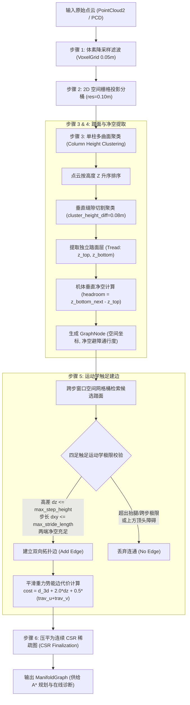
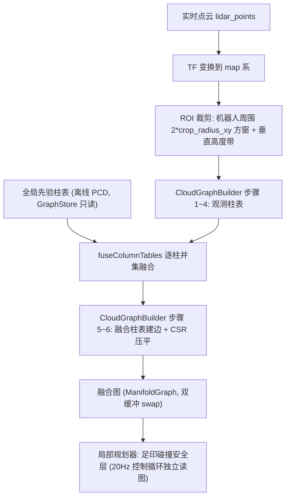

# Elevation Nav: 基于多层流形高程图的三维跨层导航系统

本项目面向四足机器人等具有离散立体跨越能力的移动底盘，提供一套从**三维点云处理、多层流形拓扑建图、全局跨层 A\* 规划**到**局部控制与 Web 3D 交互**的完整导航方案。

---

## 一、三维建图完整流程 (Point Cloud to Topology Graph)

系统通过 `elevation_planner_core` 中的 `CloudGraphBuilder` 模块，将原始三维激光点云端到端转化为紧凑的跨层拓扑流形图，全流程如下：



---

### 建图各步骤详细解析

#### 步骤 1：体素降采样滤波 (VoxelGrid Downsampling)
* **目的**：原始激光雷达点云分布极不均匀（近处每平方分米包含成千上万点，远处极稀疏），直接遍历运算开销极大。
* **机制**：将三维空间划分为 $0.05\text{m} \times 0.05\text{m} \times 0.05\text{m}$ 的立体小盒子（体素）。落在同一体素内的所有激光点取重心均值合并为一个代表点。
* **效果**：将海量无序点云压缩至均匀分布，滤除高频杂波，使建图速度提升数十倍。

#### 步骤 2：2D 空间栅格投影分桶 (Spatial Column Binning)
* **目的**：将连续的三维散点按水平位置归纳，便于空间近邻快速索引。
* **机制**：以平面分辨率（默认 $0.10\text{m}$）构建二维网格，相当于在每个网格上立起一根截面为 $0.10\text{m} \times 0.10\text{m}$、垂直延伸的空心柱子（Column）。算法遍历降采样后的点，通过 $O(N)$ 一次哈希直接归入对应的垂直柱子桶 `column_heights[r, c]`。
* **效果**：同一柱子内的所有点水平坐标 $(x, y)$ 聚集在格内，仅在垂直高度 $z$ 上存在差异。

#### 步骤 3：单柱多曲面聚类 (Vertical Column Multi-Surface Clustering) —— 核心步骤
* **目的**：突破传统 2.5D 高程图（每个网格只能存一个高度）无法表达多层立体重叠地形的痛点。在一根垂直柱子内，激光可能同时穿透地下室、一层地面、桌板、二层地面或天花板。
* **机制**：
  1. **高度排序**：将当前柱内的所有点云按高度 $z$ 升序排列：$z_0 \le z_1 \le z_2 \le \dots$
  2. **垂直缝隙切割 (`cluster_height_diff = 0.08m`)**：从最低点向上扫描相邻两点间距 $\Delta z = z_k - z_{k-1}$。若 $\Delta z \le 0.08\text{m}$，视为同一个平面的表面厚度；若 $\Delta z > 0.08\text{m}$，说明两层之间悬空断开，算法立即切割，结算当前表面并开启全新的一层。
  3. **噪点过滤 (`min_cluster_points = 2`)**：单层必须包含至少 2 个点，过滤悬空杂点。
* **效果**：一根垂直柱子被精准分解为多层独立的水平支撑面（`RawSurface`），每一层记录该平面的底高度 $z_{\text{bottom}}$ 与踩踏高度 $z_{\text{top}}$。

#### 步骤 4：踏面节点生成与机体垂直净空计算 (GraphNode & Headroom)
* **踏面（Tread）定义**：四足机器狗足端实际接触、能提供稳定法向支撑力的水平面（取当前层的最高点 $z_{\text{top}}$ 作为落足高程）。
* **净空（Headroom）定义**：当前踏面正上方到上层结构底板的垂直通过高度。机器狗站立行走具有物理高度（$dog\_height = 0.45\text{m}$），即使地面平坦，上方若过低也会发生顶头碰撞。
* **计算原理**：
  ```
         ▲ Z 轴 (垂直高度)
         │
         │    [ 上层楼板 / 天花板底面 ]   z_bottom_next
         │    -----------------------------------------
         │                        ▲
         │                        │  净空 (headroom) = z_bottom_next - z_top
         │                        │  (判断 headroom >= dog_height)
         │                        ▼
         │    -----------------------------------------
         │    [ 本层踏面 (落脚支撑面) ]   z_top
  ───────┴─────────────────────────────────────────────► 水平平面
  ```
  - 若上方开阔无遮挡，净空设为充分大（$3.0\text{m}$）；
  - 若上方存在上一层结构，$\text{headroom} = z_{\text{bottom, next}} - z_{\text{top}}$；
  - 若 $\text{headroom} < dog\_height$，标记为避障阻挡节点（`traversability = 1.0`），A\* 规划器绝不规划该空间。

#### 步骤 5：两遍式建边——短边主干 + 跨步窗口按需架桥 (Sparse Backbone + On-demand Bridging)
* **目的**：判定相邻两个空间踏面节点之间，四足机器人能否安全迈出一步，同时保持图稀疏。
* **机制**：
  **第一遍（短边主干）**：遍历节点 $u$，仅对 8 邻接格内的候选 $v$ 校验运动学极限（抬腿高差 $|u.z - v.z| \le \text{max\_step\_height}$、机体胶囊扫掠无碰撞），建立连通性主干。
  **第二遍（长边按需架桥）**：在半径 $R = \lceil \text{max\_stride\_length} / \text{resolution} \rceil$（默认 4 格）的跨步窗口内枚举长边候选，但**仅当两端经并查集判定尚不连通时才架设**——长边只出现在短边链无法连通的位置（相邻格高差锯齿、点云局部缺失、窄缝两侧），平地冗余直连边被完全消除。长边额外校验：水平跨步 $\le \text{max\_stride\_length}$（窗口由该极限反推，使参数真实生效）、途经每个栅格必须有通行高度带内的可通行节点（防止借桥跨楼梯井/空洞）、胶囊扫掠无剐蹭。
* **效果**：不论台阶视角是 50°、60° 还是 70°，只要在抬腿与步长极限内拓扑即连通；悬崖、过高断坎与超宽沟壑被自然隔断。图规模与 8 邻域方案相当，但保留了跨步极限的真实表达能力。

#### 步骤 6：压平为连续 CSR 稀疏图 (CSR Finalization)
* **目的**：解决建图过程中动态链表/向量内存分散、缓存命中率低的性能问题。
* **机制**：将所有节点的邻接边紧凑平铺至连续内存数组（Compressed Sparse Row）。每个节点仅保存起始边下标偏移（`edge_offset`）和邻接边计数（`edge_count`）。
* **效果**：A\* 算法遍历邻居节点时达到近乎 100% 的 CPU L1/L2 Cache 命中率，在数万节点的立体大图上实现 $5 \sim 10\text{ms}$ 内极速出解。

---

## 二、核心算法特点与物理内涵

### 1. 拓扑连通性（Connectivity）的物理本质

在轮式/履带式 2D/2.5D 导航中，“坡度”是决定通过性的核心，因为轮子依赖连续接触面，坡度过陡会托底滑脱。

**四足机器人属于离散触足机构（Discrete Foothold Mechanism）**，拓扑连通性的定义在本项目中回归其运动学第一性原理：

* **边代表腿部运动学工作空间包络（Kinematic Workspace）**：
  两点 $u$ 和 $v$ 之间能否建边，仅取决于机器狗能否将腿抬到该高度、跨到该距离。
* **消除经验连线角度截断**：
  建筑楼梯的踢面（Riser）通常呈垂直 $90^\circ$，相邻网格连线计算 $\arctan(\Delta z / \Delta xy)$ 会产生 $55^\circ \sim 70^\circ$ 的假象坡度。本项目移除了边倾角二值硬截断，只要高度差和跨度在物理极限内，两级踏面之间即视为完全连通。

### 2. 平滑重力做功代价模型（Soft Penalty vs Hard Cut）

取消边的硬截断并不意味着系统不加区分。系统在 A\* 代价函数中引入基于物理能耗与运动风险的平滑惩罚：

$$\text{cost} = \underbrace{\sqrt{\Delta xy^2 + \Delta z^2}}_{\text{项 1：3D 真实几何位移}} + \underbrace{w_z \cdot \Delta z}_{\text{项 2：重力势能做功惩罚}} + \underbrace{\frac{1}{2}(trav_u + trav_v)}_{\text{项 3：踏面粗糙度代价}}$$

#### (1) 公式物理含义拆解
* **项 1（3D 空间位移）**：机器狗质心在空间中行进的真实欧氏距离，位移越长基础代价越大。
* **项 2（重力势能做功惩罚，核心机制）**：
  * **物理现实**：四足机器狗在平地上行走阻力较小，但**每上一级台阶或爬坡，腿部关节电机必须持续对抗重力做功（$W = m g \Delta z$）**。垂直爬高能耗剧增、关节易过热，且跨步动态失稳风险远高于平地。
  * **参数内涵 ($w_z = 2.0$)**：相当于在算法中定量标定——**“垂直爬高 1 米所消耗的能量与失稳风险，等价于在平地上多跑 2 米”**。高差 $\Delta z$ 越大，该边的通行代价呈线性递增。
* **项 3（踏面粗糙度）**：结合网格表面特征，越颠簸的踏面增加额外的通行阻尼。

#### (2) 为什么称为“平滑（Smooth）”？对比传统硬截断
* **传统硬截断的缺陷**：
  传统方法常使用类似 `if (slope > 30.0°) continue;` 的生硬分支。这在数学上构成**阶跃断崖**（29.9° 允许通行，30.1° 立即判定为绝路），面对 50°~70° 的建筑楼梯时全图直接断连，导致 A\* 报出 `No path found` 规划失败。
* **平滑代价的优势**：
  不切断拓扑连通，将代价函数设计为关于垂直高差 $\Delta z$ **连续可导的平滑线性函数**：
  * 走平地（$\Delta z = 0$）：势能附加代价为 0，代价最低；
  * 走缓坡（$\Delta z = 0.03\text{m}$）：代价微量递增；
  * 爬台阶（$\Delta z = 0.15\text{m}$）：平滑累加势能惩罚 $2.0 \times 0.15 = 0.3$。
  全流程无任何经验魔法角度，数学模型连续严谨。

#### (3) 在全局路径搜索中的双重自主决策表现
A\* 算法的本质是寻找全图**总代价最小（Cost 最低）**的路径，平滑势能代价使规划器具备了自适应决策能力：
1. **有平路时自主绕行（优先平路）**：
   若终点可以通过走廊平缓绕行，也可以直接爬一段陡楼梯。虽然爬楼梯几何位移稍短，但因重力势能项 $w_z \cdot \Delta z$ 的大幅惩罚，走平路的总代价更低，**A\* 规划器会自动优选平坦绕行通道**，避免让狗冒攀爬风险。
2. **仅有楼梯时确保连通（保证可达）**：
   若场景中无平缓通道（必须跨楼层登楼），由于楼梯在拓扑上未被 `if` 语句砍断（边完全连通），**规划器绝不会报错，而是平稳搜索出走楼梯的最优跨层路径**。

### 3. 多层流形表达（Manifold Graph）

* **超越传统 2.5D 高程图**：传统高程图为单值映射 $z = f(x, y)$，在多层连廊、高架下或立体建筑中会覆盖底层信息。
* **分层曲面拓扑**：单列支持任意数量的垂直重叠踏面，通过净空判定隔离并按三维欧氏距离和抬腿能力建立跨层边。

### 4. 机体碰撞建模（侧向足印膨胀 + 建边扫掠）

足端运动学约束（抬腿/跨步）只保证**落足点**可达，不保证**机体**不与侧向结构剐蹭——楼梯转角贴墙、对角边内切墙角是典型碰撞场景。系统在图构建阶段引入机体建模：

* **侧向障碍判据**：邻格表面若"垂直范围跨越攀爬包络"（结构底面贴近本层踏面、顶面超过 `tread_z + k * max_step_height`，k 为格距）判定为墙体/台沿类侧向障碍。攀爬包络与建边运动学口径一致：每前进一格最多再爬一级 `max_step_height`，因此连续楼梯永不跨越该包络、爬楼梯本身不会被误判；k=1（贴身）时退化为单步踏步极限线，墙体/转角防护不变。头顶楼板底面高于机体带，同样不受影响。
* **双层膨胀**：侧向障碍进入 `body_hard_radius`（半身宽+余量）内 → 节点硬阻挡；进入 `footprint_radius` 内 → 随距离衰减的软代价。A* 因此自动走走廊中线、过转角沿外侧圆滑绕行。
* **建边胶囊扫掠**：对每条边沿 $u \to v$ 线段采样，在水平方向做机体胶囊判定——硬半径内出现**本行走层**的禁行节点即丢弃该边（专治"两端自由但斜线切墙角"的转角内切）；垂直方向仅做选层过滤：只考虑 $[sz - \text{foot\_clearance},\ sz + \text{dog\_height}]$ 内的禁行节点，脚平面以下的禁行节点是被踩的楼梯结构/其他层，不参与水平判定。扫掠区触及软膨胀带时提高边代价。
* **平滑防回侵**：路径平滑器逐点回查膨胀图，平滑落点落入阻挡区（或图外空白格，防楼梯边缘悬空）即回退到原始路径点。
* **局部安全停车**：局部规划器每控制周期对当前位置做足印圆碰撞检查（足印半径内出现阻挡节点即停车），与全局膨胀共用同一套 traversability 语义。

---

## 三、功能包架构

| 模块 | 功能描述 |
| :--- | :--- |
| **`elevation_planner_core`** | 核心拓扑图定义 (`ManifoldGraph`)、点云拓扑建图器 (`CloudGraphBuilder`，含柱表生成/逐柱融合/建边压平两段式管线)、进程级共享存储 (`GraphStore`)、跨层门户 (`LayerPortal`)、代价评估器 (`CostEvaluator`) |
| **`elevation_map_loader`** | 点云加载、流形森林生成器 (`ManifoldForest`)、FastAPI 服务端与 Web 3D 可视化交互编辑器、仿真伪 TF 广播 |
| **`elevation_global_planner`** | move_base 全局规划器插件 (`ElevationGlobalPlanner`)：离线 PCD 先验建图、跨层 A* (`ManifoldAStar`)、路径平滑 (`PathSmoother`)、在线 C++ 拓扑诊断服务 |
| **`elevation_local_planner`** | move_base 局部规划器插件 (`ElevationLocalPlannerPlugin`)：D1 比例跟踪控制、实时点云融合图后台线程、融合图足印碰撞安全层、速度指令生成 (`/cmd_vel`) |

---

## 四、核心配置参数说明

| 参数名 | 默认值 | 物理含义与作用 |
| :--- | :--- | :--- |
| `resolution` | `0.10` | 2D 空间栅格投影分辨率 (m) |
| `max_step_height` | `0.25` | 四足机器人单步最大踏步高差极限 (m) |
| `max_stride_length` | `0.35` | 四足机器人单步最大水平跨步步长 (m) |
| `dog_height` | `0.45` | 机器狗通行站立高度阈值，低于此净空标记为顶头避障 (m) |
| `cluster_height_diff` | `0.08` | 垂直单柱点云聚类厚度间距，用于分离开重叠踏面 (m) |
| `min_cluster_points` | `2` | 构成有效支撑踏面所需的最小点云数 |
| `sor_mean_k` | `16` | SOR 残影点过滤近邻统计点数 |
| `sor_std_mul` | `1.5` | SOR 标准差倍数阈值，越大越保守，极大值等效关闭 |
| `footprint_radius` | `0.30` | 机体足印外接半径 (m)，侧向障碍软代价膨胀边界 |
| `body_hard_radius` | `0.20` | 机体硬阻挡半径 (m)，约半身宽+安全余量，侧向障碍进入此范围节点不可通行 |
| `sweep_penalty_weight` | `1.0` | 建边时机体扫掠区软代价权重 |
| `foot_clearance` | `0.05` | 足底容差 (m)，行走面下方此深度内的禁行节点仍保守视为剐蹭，更深处视为脚下楼梯结构/其他层 |
| `crop_radius_xy` | `1.5` | 实时点云融合的 ROI 滚动窗口半径 (m)，融合图边长 = 2 × crop_radius_xy |
| `crop_height_above` / `crop_height_below` | `2.0` / `1.0` | ROI 裁剪的垂直高度带：机器人脚下平面以上/以下保留范围 (m) |
| `fusion_rate` | `5.0` | 融合图刷新频率 (Hz)，与控制循环 (controller_frequency) 解耦 |
| `cloud_topic` | `lidar_points` | 实时点云话题，融合线程的数据源 |

---

## 五、实时点云融合与 move_base 导航架构

### 1. 融合图数据流 (Live Cloud to Fused Graph)

系统在离线先验图之外，维护一张机器人周围的**滚动融合图**：实时点云只覆盖传感器当前视场（且被机体遮挡扫不到脚下），单独建图会产生"图闪烁"与脚下空洞；融合层将观测与先验逐柱合并，兼得实时性与完整性。



### 2. 逐柱并集融合规则 (fuseColumnTables)

先验柱表与观测柱表共用同一份 `GraphBuildConfig` 与栅格分辨率，节点按 `(row, col, layer)` 天然对齐。对窗口内每根柱独立合并：

1. **同一物理面**（两侧 `z_top` 差 ≤ `cluster_height_diff`）：合并为一层，几何取观测值（反映当前状态），点数取 max（一次稀疏观测不推翻先验已确认的支撑面）；
2. **仅存在于先验**：原样保留——实时雷达被机体遮挡扫不到脚下时，先验地面层仍在，脚下永远有支撑面；
3. **仅存在于观测**：新增一层（实时发现的新踏面或新障碍）；
4. **窗口最外一圈强制采用先验**：保证融合图与全局图在窗口边界处拓扑衔接。

融合**无时间衰减**：观测柱表每帧从零重建、先验柱表永不被写入，动态障碍只存在于被扫到的当帧，下帧自动消失，无需衰减参数。融合只决定"每根柱上有哪些层、每层的通行性"，**建边不融合**——融合柱表整体走同一套建边判据（短边主干 + 跨步架桥 + 胶囊扫掠）重建，保证融合图与全局图的运动学口径完全一致。

### 3. move_base 插件化架构

规划闭环统一由 move_base 调度，全局/局部均为 nav_core 插件：

| 插件 | 注册名 | 职责 |
| :--- | :--- | :--- |
| `ElevationGlobalPlanner` | `elevation_global_planner/ElevationGlobalPlanner` | 离线 PCD 建图（柱表+全局图写入 GraphStore）、`makePlan` = 起终点锚定 → 跨层 A* → 平滑；全局图保持纯先验，不订阅实时点云 |
| `ElevationLocalPlannerPlugin` | `elevation_local_planner/ElevationLocalPlannerPlugin` | D1 比例跟踪（3D 前瞻投影选点 + 纵/横/航向三通道 + 加速度限幅）；后台融合线程按 `fusion_rate` 刷新融合图；控制周期入口先做融合图足印碰撞检查，命中禁行节点即零速停车 |

costmap 仅保留空层维持 move_base 框架运转，3D 规划与避障完全由流形图承担。局部持续受阻时由 move_base 的恢复行为与 `planner_frequency` 周期重规划形成闭环。

### 4. 仿真与实机启动

```bash
# 仿真 (默认): Web 端伪 TF 广播 map->odom->base_link, /cmd_vel 积分运动
roslaunch elevation_map_loader navigation.launch

# 实机: 关闭伪 TF, 位姿来自实机定位
roslaunch elevation_map_loader navigation.launch sim:=false
```

- **设置起点 = 触发 TF 变换**：Web 端吸附踏面节点设置起点时，仿真模式下机器人位姿立即跳转该处（直接采用吸附节点的踏面高程，不在二次贴地探测中掉层）；实机模式下仅发布 `/initialpose`，不动 TF
- **设置终点 = 触发 move_base 规划**：发布 `/move_base_simple/goal`，路径经 `/move_base/plan` 与 `/elevation_global_plan` (latched) 回传前端
- 行进中地形跟随采用**分层带过滤**：优先 `|dz| ≤ max_step_height` 的同层踏面带，禁止经楼板边缘时跨层瞬移
