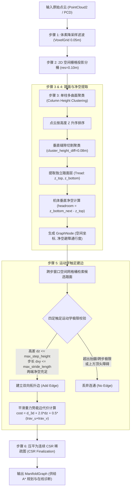
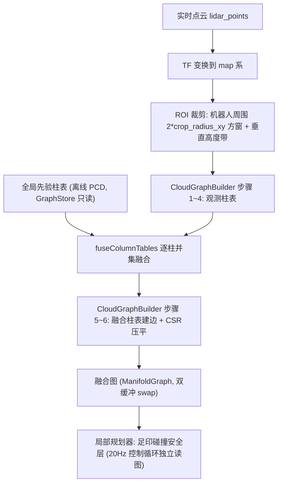

# Elevation Nav: 基于多层流形高程图的三维跨层导航系统

本项目面向四足机器人等具有离散立体跨越能力的移动底盘，提供一套从**三维点云处理、多层流形拓扑建图、全局跨层 A\* 规划**到**局部控制与 Web 3D 交互**的完整导航方案。

---

## 一、三维建图完整流程 (Point Cloud to Topology Graph)

系统通过 `elevation_planner_core` 中的 `CloudGraphBuilder` 模块，将原始三维激光点云端到端转化为紧凑的跨层拓扑流形图，全流程如下：


```mermaid
flowchart TD
    A["输入原始点云 (PointCloud2 / PCD)"] --> B["步骤 1: 体素降采样滤波 (VoxelGrid 0.05m)"]
    B --> C["步骤 2: 2D 空间栅格投影分桶 (res=0.10m)"]
    C --> D["步骤 3: 单柱多曲面聚类 (Column Height Clustering)"]
    
    subgraph 步骤 3 & 4: 踏面与净空提取
        D --> E["点云按高度 Z 升序排序"]
        E --> F["垂直缝隙切割聚类 (cluster_height_diff=0.08m)"]
        F --> G["提取独立踏面层 (Tread: z_top, z_bottom)"]
        G --> H["机体垂直净空计算 (headroom = z_bottom_next - z_top)"]
        H --> I["生成 GraphNode (空间坐标, 净空避障通行度)"]
    end

    subgraph 步骤 5: 运动学触足建边
        I --> J["跨步窗口空间网格桶检索候选踏面"]
        J --> K{"四足触足运动学极限校验"}
        K -- "高差 dz <= max_step_height<br/>步长 dxy <= max_stride_length<br/>两端净空充足" --> L["建立双向拓扑边 (Add Edge)"]
        K -- "超出抬腿/跨步极限<br/>或上方顶头障碍" --> M["丢弃连通 (No Edge)"]
        L --> N["平滑重力势能边代价计算<br/>cost = d_3d + 2.0*dz + 0.5*(trav_u+trav_v)"]
    end

    N --> O["步骤 6: 压平为连续 CSR 稀疏图 (CSR Finalization)"]
    O --> P["输出 ManifoldGraph (供给 A* 规划与在线诊断)"]
```

---

### 建图各步骤详细解析

#### 步骤 1：体素降采样滤波 (VoxelGrid Downsampling)
* **目的**：原始激光雷达点云分布极不均匀（近处每平方分米包含成千上万点，远处极稀疏），直接遍历运算开销极大。
* **机制**：将三维空间划分为 $0.05\text{m} \times 0.05\text{m} \times 0.05\text{m}$ 的立体小盒子（体素）。落在同一体素内的所有激光点取重心均值合并为一个代表点。
* **效果**：将海量无序点云压缩至均匀分布，滤除高频杂波，使建图速度提升数十倍。

#### 步骤 2：2D 空间栅格投影分桶 (Spatial Column Binning)
* **目的**：将连续的三维散点按水平位置归纳，便于空间近邻快速索引。
* **机制**：以平面分辨率（默认 $0.10\text{m}$）构建二维网格，相当于在每个网格上立起一根截面为 $0.10\text{m} \times 0.10\text{m}$、垂直延伸的空心柱子（Column）。算法遍历降采样后的点，通过 $O(N)$ 一次哈希直接归入对应的垂直柱子桶 `column_heights[r, c]`。
* **效果**：同一柱子内的所有点水平坐标 $(x, y)$ 聚集在格内，仅在垂直高度 $z$ 上存在差异。

#### 步骤 3：单柱多曲面聚类 (Vertical Column Multi-Surface Clustering) —— 核心步骤
* **目的**：突破传统 2.5D 高程图（每个网格只能存一个高度）无法表达多层立体重叠地形的痛点。在一根垂直柱子内，激光可能同时穿透地下室、一层地面、桌板、二层地面或天花板。
* **机制**：
  1. **高度排序**：将当前柱内的所有点云按高度 $z$ 升序排列：$z_0 \le z_1 \le z_2 \le \dots$
  2. **垂直缝隙切割 (`cluster_height_diff = 0.08m`)**：从最低点向上扫描相邻两点间距 $\Delta z = z_k - z_{k-1}$。若 $\Delta z \le 0.08\text{m}$，视为同一个平面的表面厚度；若 $\Delta z > 0.08\text{m}$，说明两层之间悬空断开，算法立即切割，结算当前表面并开启全新的一层。
  3. **噪点过滤 (`min_cluster_points = 2`)**：单层必须包含至少 2 个点，过滤悬空杂点。
* **效果**：一根垂直柱子被精准分解为多层独立的水平支撑面（`RawSurface`），每一层记录该平面的底高度 $z_{\text{bottom}}$ 与踩踏高度 $z_{\text{top}}$。

#### 步骤 4：踏面节点生成与机体垂直净空计算 (GraphNode & Headroom)
* **踏面（Tread）定义**：四足机器狗足端实际接触、能提供稳定法向支撑力的水平面（取当前层的最高点 $z_{\text{top}}$ 作为落足高程）。
* **净空（Headroom）定义**：当前踏面正上方到上层结构底板的垂直通过高度。机器狗站立行走具有物理高度（$dog\_height = 0.45\text{m}$），即使地面平坦，上方若过低也会发生顶头碰撞。
* **计算原理**：
  ```
         ▲ Z 轴 (垂直高度)
         │
         │    [ 上层楼板 / 天花板底面 ]   z_bottom_next
         │    -----------------------------------------
         │                        ▲
         │                        │  净空 (headroom) = z_bottom_next - z_top
         │                        │  (判断 headroom >= dog_height)
         │                        ▼
         │    -----------------------------------------
         │    [ 本层踏面 (落脚支撑面) ]   z_top
  ───────┴─────────────────────────────────────────────► 水平平面
  ```
  - 若上方开阔无遮挡，净空设为充分大（$3.0\text{m}$）；
  - 若上方存在上一层结构，$\text{headroom} = z_{\text{bottom, next}} - z_{\text{top}}$；
  - 若 $\text{headroom} < dog\_height$，标记为避障阻挡节点（`traversability = 1.0`），A\* 规划器绝不规划该空间。

#### 步骤 5：两遍式建边——短边主干 + 跨步窗口按需架桥 (Sparse Backbone + On-demand Bridging)
* **目的**：判定相邻两个空间踏面节点之间，四足机器人能否安全迈出一步，同时保持图稀疏。
* **机制**：
  **第一遍（短边主干）**：遍历节点 $u$，仅对 8 邻接格内的候选 $v$ 校验运动学极限（抬腿高差 $|u.z - v.z| \le \text{max\_step\_height}$、机体胶囊扫掠无碰撞），建立连通性主干。
  **第二遍（长边按需架桥）**：在半径 $R = \lceil \text{max\_stride\_length} / \text{resolution} \rceil$（默认 4 格）的跨步窗口内枚举长边候选，但**仅当两端经并查集判定尚不连通时才架设**——长边只出现在短边链无法连通的位置（相邻格高差锯齿、点云局部缺失、窄缝两侧），平地冗余直连边被完全消除。长边额外校验：水平跨步 $\le \text{max\_stride\_length}$（窗口由该极限反推，使参数真实生效）、途经每个栅格必须有通行高度带内的可通行节点（防止借桥跨楼梯井/空洞）、胶囊扫掠无剐蹭。
* **效果**：不论台阶视角是 50°、60° 还是 70°，只要在抬腿与步长极限内拓扑即连通；悬崖、过高断坎与超宽沟壑被自然隔断。图规模与 8 邻域方案相当，但保留了跨步极限的真实表达能力。

#### 步骤 6：压平为连续 CSR 稀疏图 (CSR Finalization)
* **目的**：解决建图过程中动态链表/向量内存分散、缓存命中率低的性能问题。
* **机制**：将所有节点的邻接边紧凑平铺至连续内存数组（Compressed Sparse Row）。每个节点仅保存起始边下标偏移（`edge_offset`）和邻接边计数（`edge_count`）。
* **效果**：A\* 算法遍历邻居节点时达到近乎 100% 的 CPU L1/L2 Cache 命中率，在数万节点的立体大图上实现 $5 \sim 10\text{ms}$ 内极速出解。

---

## 二、核心算法特点与物理内涵

### 1. 拓扑连通性（Connectivity）的物理本质

在轮式/履带式 2D/2.5D 导航中，“坡度”是决定通过性的核心，因为轮子依赖连续接触面，坡度过陡会托底滑脱。

**四足机器人属于离散触足机构（Discrete Foothold Mechanism）**，拓扑连通性的定义在本项目中回归其运动学第一性原理：

* **边代表腿部运动学工作空间包络（Kinematic Workspace）**：
  两点 $u$ 和 $v$ 之间能否建边，仅取决于机器狗能否将腿抬到该高度、跨到该距离。
* **消除经验连线角度截断**：
  建筑楼梯的踢面（Riser）通常呈垂直 $90^\circ$，相邻网格连线计算 $\arctan(\Delta z / \Delta xy)$ 会产生 $55^\circ \sim 70^\circ$ 的假象坡度。本项目移除了边倾角二值硬截断，只要高度差和跨度在物理极限内，两级踏面之间即视为完全连通。

### 2. 平滑重力做功代价模型（Soft Penalty vs Hard Cut）

取消边的硬截断并不意味着系统不加区分。系统在 A\* 代价函数中引入基于物理能耗与运动风险的平滑惩罚：

$$\text{cost} = \underbrace{\sqrt{\Delta xy^2 + \Delta z^2}}_{\text{项 1：3D 真实几何位移}} + \underbrace{w_z \cdot \Delta z}_{\text{项 2：重力势能做功惩罚}} + \underbrace{\frac{1}{2}(trav_u + trav_v)}_{\text{项 3：踏面粗糙度代价}}$$

#### (1) 公式物理含义拆解
* **项 1（3D 空间位移）**：机器狗质心在空间中行进的真实欧氏距离，位移越长基础代价越大。
* **项 2（重力势能做功惩罚，核心机制）**：
  * **物理现实**：四足机器狗在平地上行走阻力较小，但**每上一级台阶或爬坡，腿部关节电机必须持续对抗重力做功（$W = m g \Delta z$）**。垂直爬高能耗剧增、关节易过热，且跨步动态失稳风险远高于平地。
  * **参数内涵 ($w_z = 2.0$)**：相当于在算法中定量标定——**“垂直爬高 1 米所消耗的能量与失稳风险，等价于在平地上多跑 2 米”**。高差 $\Delta z$ 越大，该边的通行代价呈线性递增。
* **项 3（踏面粗糙度）**：结合网格表面特征，越颠簸的踏面增加额外的通行阻尼。

#### (2) 为什么称为“平滑（Smooth）”？对比传统硬截断
* **传统硬截断的缺陷**：
  传统方法常使用类似 `if (slope > 30.0°) continue;` 的生硬分支。这在数学上构成**阶跃断崖**（29.9° 允许通行，30.1° 立即判定为绝路），面对 50°~70° 的建筑楼梯时全图直接断连，导致 A\* 报出 `No path found` 规划失败。
* **平滑代价的优势**：
  不切断拓扑连通，将代价函数设计为关于垂直高差 $\Delta z$ **连续可导的平滑线性函数**：
  * 走平地（$\Delta z = 0$）：势能附加代价为 0，代价最低；
  * 走缓坡（$\Delta z = 0.03\text{m}$）：代价微量递增；
  * 爬台阶（$\Delta z = 0.15\text{m}$）：平滑累加势能惩罚 $2.0 \times 0.15 = 0.3$。
  全流程无任何经验魔法角度，数学模型连续严谨。

#### (3) 在全局路径搜索中的双重自主决策表现
A\* 算法的本质是寻找全图**总代价最小（Cost 最低）**的路径，平滑势能代价使规划器具备了自适应决策能力：
1. **有平路时自主绕行（优先平路）**：
   若终点可以通过走廊平缓绕行，也可以直接爬一段陡楼梯。虽然爬楼梯几何位移稍短，但因重力势能项 $w_z \cdot \Delta z$ 的大幅惩罚，走平路的总代价更低，**A\* 规划器会自动优选平坦绕行通道**，避免让狗冒攀爬风险。
2. **仅有楼梯时确保连通（保证可达）**：
   若场景中无平缓通道（必须跨楼层登楼），由于楼梯在拓扑上未被 `if` 语句砍断（边完全连通），**规划器绝不会报错，而是平稳搜索出走楼梯的最优跨层路径**。

### 3. 多层流形表达（Manifold Graph）

* **超越传统 2.5D 高程图**：传统高程图为单值映射 $z = f(x, y)$，在多层连廊、高架下或立体建筑中会覆盖底层信息。
* **分层曲面拓扑**：单列支持任意数量的垂直重叠踏面，通过净空判定隔离并按三维欧氏距离和抬腿能力建立跨层边。

### 4. 机体碰撞建模（侧向足印膨胀 + 建边扫掠）

足端运动学约束（抬腿/跨步）只保证**落足点**可达，不保证**机体**不与侧向结构剐蹭——楼梯转角贴墙、对角边内切墙角是典型碰撞场景。系统在图构建阶段引入机体建模：

* **侧向障碍判据**：邻格表面若"垂直范围跨越攀爬包络"（结构底面贴近本层踏面、顶面超过 `tread_z + k * max_step_height`，k 为格距）判定为墙体/台沿类侧向障碍。攀爬包络与建边运动学口径一致：每前进一格最多再爬一级 `max_step_height`，因此连续楼梯永不跨越该包络、爬楼梯本身不会被误判；k=1（贴身）时退化为单步踏步极限线，墙体/转角防护不变。头顶楼板底面高于机体带，同样不受影响。
* **双层膨胀**：侧向障碍进入 `body_hard_radius`（半身宽+余量）内 → 节点硬阻挡；进入 `footprint_radius` 内 → 随距离衰减的软代价。A* 因此自动走走廊中线、过转角沿外侧圆滑绕行。
* **建边胶囊扫掠**：对每条边沿 $u \to v$ 线段采样，在水平方向做机体胶囊判定——硬半径内出现**本行走层**的禁行节点即丢弃该边（专治"两端自由但斜线切墙角"的转角内切）；垂直方向仅做选层过滤：只考虑**行走面高度至行走面高度 + 机体高度**内的禁行节点——身体在脚平面以上，行走面以下的点（被踩的台阶、下层楼板、矮沿）碰不到身体；与行走面同高的禁行点仍算碰撞（低顶通道以同高禁行点标记）。扫掠区触及软膨胀带时提高边代价。
* **平滑防回侵**：路径平滑器逐点回查膨胀图，平滑落点落入阻挡区（或图外空白格，防楼梯边缘悬空）即回退到原始路径点。
* **局部安全停车**：局部规划器每控制周期对当前位置做足印圆碰撞检查（足印半径内出现阻挡节点即停车），与全局膨胀共用同一套 traversability 语义。

---

## 三、功能包架构

| 模块 | 功能描述 |
| :--- | :--- |
| **`elevation_planner_core`** | 核心拓扑图定义 (`ManifoldGraph`)、点云拓扑建图器 (`CloudGraphBuilder`，含柱表生成/逐柱融合/建边压平两段式管线)、进程级共享存储 (`GraphStore`)、跨层门户 (`LayerPortal`)、代价评估器 (`CostEvaluator`)、统一的 A\* 搜索实现 (`ManifoldSearch`)、路径直线连通性检查与航点合并工具 (`PathSimplifier`) |
| **`elevation_sim`** | 仿真与可视化套件：FastAPI/Web 3D 前端、伪 TF 广播、PCD 先验地图提供节点 (`pcd_to_grid_map_node`)、障碍物注入器 (`obstacle_injector`)、bag 回放模式 |
| **`elevation_global_planner`** | move_base 全局规划器插件 (`ElevationGlobalPlanner`)：离线 PCD 先验建图、跨层 A* (`ManifoldAStar`)、防割角平滑 (`PathSmoother`)、在线 C++ 拓扑诊断服务 |
| **`elevation_local_planner`** | move_base 局部规划器插件 (`AStarLocalPlanner`)：基于 3D 流形拓扑图的局部 A* 动态避障寻优与前瞻平滑跟踪控制，速度指令生成 (`/cmd_vel`) |
| **`elevation_costmap`** | move_base 进程内融合宿主插件 (`ManifoldCostmapLayer`)：承载 `ManifoldFusionEngine` 以 10Hz 维护实时点云融合图并写入 GraphStore，供局部规划器零拷贝读图做动态避障 (地毯渲染链路已随 TEB 移除删除) |

---

## 四、核心配置参数说明

| 参数名 | 默认值 | 物理含义与作用 |
| :--- | :--- | :--- |
| `resolution` | `0.10` | 2D 空间栅格投影分辨率 (m) |
| `max_step_height` | `0.25` | 四足机器人单步最大踏步高差极限 (m) |
| `max_stride_length` | `0.35` | 四足机器人单步最大水平跨步步长 (m) |
| `dog_height` | `0.45` | 机器狗通行站立高度阈值，低于此净空标记为顶头避障 (m) |
| `cluster_height_diff` | `0.08` | 垂直单柱点云聚类厚度间距，用于分离开重叠踏面 (m) |
| `min_cluster_points` | `2` | 构成有效支撑踏面所需的最小点云数 (过滤悬浮噪点与离散残影) |
| `sor_mean_k` | `16` | SOR 残影点过滤近邻统计点数 |
| `sor_std_mul` | `4` | SOR 标准差倍数阈值 (越大越保守，极大值等效关闭)。需落在表面点与真离群点的分布间隙：过小会将楼梯踏面边缘点误判为离群点整层删除 |
| `footprint_radius` | `0.24` | 机体足印外接半径 (m)，侧向障碍软代价膨胀边界，紧凑贴合机体 |
| `body_hard_radius` | `0.15` | 机体硬阻挡半径 (m)，约为半身宽 0.14m + 最小安全余量，侧向障碍进入此范围节点不可通行 |
| `sweep_penalty_weight` | `1.0` | 建边时机体扫掠区软代价权重 |
| `crop_radius_xy` | `1.5` | 实时点云融合的 ROI 滚动窗口半径 (m)，融合图边长 = 2 × crop_radius_xy |
| `crop_height_above` / `crop_height_below` | `2.0` / `1.0` | ROI 裁剪的垂直高度带：机器人脚下平面以上/以下保留范围 (m) |
| `fusion_rate` | `5.0` | 融合图刷新频率 (Hz)，与控制循环 (controller_frequency) 解耦 |
| `corridor_radius` | `3.0` | 拓扑流形管道最大展开半宽 (m)，沿连通图向外膨胀至此半径，遇悬空/断崖/不可达自然停止 |
| `cloud_topic` | `lidar_points` | 实时点云话题，融合线程的数据源 |

---

## 五、实时点云融合与 move_base 导航架构

### 1. 融合图数据流 (Live Cloud to Fused Graph)

系统在离线先验图之外，维护一张机器人周围的**滚动融合图**：实时点云只覆盖传感器当前视场（且被机体遮挡扫不到脚下），单独建图会产生"图闪烁"与脚下空洞；融合层将观测与先验逐柱合并，兼得实时性与完整性。


```mermaid
flowchart TD
    A["实时点云 lidar_points"] --> B["TF 变换到 map 系"]
    B --> C["ROI 裁剪: 机器人周围 2*crop_radius_xy 方窗 + 垂直高度带"]
    C --> D["CloudGraphBuilder 步骤 1~4: 观测柱表"]
    E["全局先验柱表 (离线 PCD, GraphStore 只读)"] --> F["fuseColumnTables 逐柱并集融合"]
    D --> F
    F --> G["CloudGraphBuilder 步骤 5~6: 融合柱表建边 + CSR 压平"]
    G --> H["融合图 (ManifoldGraph, 双缓冲 swap)"]
    H --> I["局部规划器: 足印碰撞安全层 (20Hz 控制循环独立读图)"]
```

### 2. 逐柱并集融合规则 (fuseColumnTables)

先验柱表与观测柱表共用同一份 `GraphBuildConfig` 与栅格分辨率，节点按 `(row, col, layer)` 天然对齐。对窗口内每根柱独立合并：

1. **同一物理面**（两侧 `z_top` 差 ≤ `cluster_height_diff`）：合并为一层，几何取观测值（反映当前状态），点数取 max（一次稀疏观测不推翻先验已确认的支撑面）；
2. **仅存在于先验**：原样保留——实时雷达被机体遮挡扫不到脚下时，先验地面层仍在，脚下永远有支撑面；
3. **仅存在于观测**：新增一层（实时发现的新踏面或新障碍）；
4. **窗口最外一圈强制采用先验**：保证融合图与全局图在窗口边界处拓扑衔接。

融合**无时间衰减**：观测柱表每帧从零重建、先验柱表永不被写入，动态障碍只存在于被扫到的当帧，下帧自动消失，无需衰减参数。融合只决定"每根柱上有哪些层、每层的通行性"，**建边不融合**——融合柱表整体走同一套建边判据（短边主干 + 跨步架桥 + 胶囊扫掠）重建，保证融合图与全局图的运动学口径完全一致。

### 3. move_base 插件化架构

规划闭环统一由 move_base 调度，全局/局部均为 nav_core 插件：

| 插件 | 注册名 | 职责 |
| :--- | :--- | :--- |
| `ElevationGlobalPlanner` | `elevation_global_planner/ElevationGlobalPlanner` | 离线 PCD 建图（柱表+全局图写入 GraphStore）、`makePlan` = 起终点锚定 → 跨层 A* → 平滑；全局图保持纯先验，不订阅实时点云 |
| `AStarLocalPlanner` | `elevation_local_planner/AStarLocalPlanner` | 规划器 A (默认): 3D 流形局部 A* 动态避障与前瞻平滑跟踪控制（直接读取 GraphStore 融合图、遇阻实时重规划、速度平滑滤波） |

### 4. 1:1 流形代价地图插件 (ManifoldCostmapLayer)

由 `elevation_costmap` 包提供标准的 `costmap_2d::Layer` 内部插件 `ManifoldCostmapLayer`，直接运行在 `move_base` 进程内部：
1. **零拷贝共享**：直接同进程零拷贝访问 `GraphStore::instance()` 获取全局先验图，无需重复加载 PCD 文件；
2. **点云融合与地毯构建**：后台线程按 10Hz 高频维护点云融合图，执行纯几何“地毯铺设”算法，构建 1:1 绝对真实的平坦局部地图；
3. **消除死等阻塞**：纯异步非阻塞设计，开机 0ms 顺畅启动；`updateCosts` 直接将 1:1 踏面与障碍写进 `local_costmap` 的 Master Grid，供局部规划与可视化消费；
4. **调试可视化**：同步向 `/elevation_local_costmap` 发布话题，方便在 RViz 中直观监控。

### 5. 仿真与实机启动

```bash
# 1. 仿真模式
roslaunch elevation_sim navigation.launch

# 2. 实机运行 (关闭伪 TF)
roslaunch elevation_sim navigation.launch sim:=false
```

- **设置起点 = 触发 TF 变换**：Web 端吸附踏面节点设置起点时，仿真模式下机器人位姿立即跳转该处（直接采用吸附节点的踏面高程，不在二次贴地探测中掉层）；实机模式下仅发布 `/initialpose`，不动 TF
- **设置终点 = 触发 move_base 规划**：发布 `/move_base_simple/goal`，路径经 `/move_base/plan` 与 `/elevation_global_plan` (latched) 回传前端
- 行进中地形跟随采用**分层带过滤**：优先 `|dz| ≤ max_step_height` 的同层踏面带，禁止经楼板边缘时跨层瞬移

### 6. Web 端三维流形与局部规划可视化

- **流形局部代价地图 (地毯模式)**：订阅 `/elevation_local_costmap`，通过 Three.js CanvasTexture 实时在机器狗脚下投影 6m×6m 贴地半透明地毯（0=自由青绿、1~99=软膨胀橙黄、100=致命红、255=空洞透明），直观展示局部可通行域。
- **动态图层显隐**：前端支持“☑ 局部地图(流形)”与“☑ 局部规划(黄)”独立切换控制。

### 7. 狭窄通道通行与拐角主动大弧度外绕机制

- **狭窄走廊通过性**：将 `body_hard_radius` 降至 `0.15m`（半机身宽 0.14m + 最小安全余量），彻底消除走廊北立柱等侧向凸起的虚假硬碰撞阻断；
- **八边形倒角足印**：采用八边形贴合机体倒角模型替代锐利长方形，消除 90° 直角转弯时尾角外扫碰壁问题；
- **全局 A\* 拐角主动外绕**：提高贴墙软代价权重（`0.5` $\to$ `2.5`），迫使 A\* 在转弯前主动向开阔区域拉开安全距离；
- **平滑防内切保护**：平滑算法增加 `traversability >= 0.40` 软膨胀区保护门限，严禁平滑向内角割角；

---

## 六、2026-09-14 更新：代价地图三重防护、全链路 z 约束与 Web 调试体系

### 1. 建图鲁棒性修复 (elevation_planner_core)

- **SOR 统计滤波阈值修正（`sor_std_mul` 1.5 → 4）**：楼梯踏面边缘点的近邻平均距离天然高于大平面，旧阈值恰好切在表面点分布带中间，导致楼梯井等区域踏面被统计滤波整层删除、地图成片空洞。新阈值落在表面点与真离群点的天然间隙上，残影防护保留。
- **净空计算跳过杂点面（`min_cluster_points` 4 → 2 配套）**：柱内点数不足最小点数门槛的面层不再参与上方净空计算——单个噪声点即可伪装"天花板"，把正常节点误判为顶头禁行，并经身体扫掠将周边连线全部剪光（表现为楼梯边节点度数归零、孤立悬空）。
- **身体碰撞检查高度窗口下沿改为行走面（移除 `foot_clearance`）**：机体扫掠只检查"行走面至行走面+机体高度"内的禁行点——身体在脚平面以上，被踩的台阶、下层楼板、矮沿碰不到身体。修复楼梯边缘同层连线成片被剪断、地毯沿楼梯连成致命缝的问题。

### 2. 代价地图三重防护与逐格调试体系 (elevation_costmap)

- **拓扑缝**：相邻踏面格在流形图中无任何连通边（错层/断坎/扫掠阻挡）时，在交界处绘制致命缝——阻止 TEB 的二维轨迹穿越图上不存在的连接。全量验证：所有图边无一穿越缝边界。
- **形态学闭运算**：图节点缺失造成的 1~2 格孤立致命补丁（盖章半径 0.08m 小于节点间距 0.10m 的固有伪影）自动填充为可通行；成片真实空洞（楼梯井/断崖）不受影响。
- **地毯连通性泛洪**：盖章完成后从机器人所在格沿自由格做 4 邻域泛洪，"图上联通但地毯上绕道图外到达"的自由透印区（异层节点投到其它高度的地毯上）全部转致命——修复狗沿合法同层路径绕到目标/边缘下方导致的坠落与假到达。
- **逐格调试图层**：`/elevation_local_costmap_debug`（每格 8 类成因码：无节点盖章/自由/软代价/净空/侧向/拓扑缝/闭运算填充/透印隔离）与 `/elevation_local_costmap_debug_nodes`（逐格胜出节点 id + 节点坐标表，毫米精度），支撑 Web 端逐格诊断"看不见的障碍"到底是谁盖的章。

### 3. 导航链路修复

- **倒车进目标修复**：全局路径按行进方向重算每个位姿的朝向（原为全零四元数），TEB 不再把倒车通道当作最优进入方式；配合前进权重 2.0 → 5.0。
- **局部避障增强**：`min_obstacle_dist` 0.04 → 0.08（脱离贴脸距离），局部代价地图挂载标准 `inflation_layer`（膨胀半径 0.25m）——此前该参数存在于配置中但无任何层消费。
- **伪 TF 贴地坠落修复**：贴地跟随的地形探测过滤禁行节点——楼梯下方净空不足的主层地面不再把站在楼梯上的狗"吸"下去。
- **黄线跳层修复**：局部轨迹 z 投影增加分层带过滤（优先 |Δz| ≤ max_step_height 的同层航点），跨层路径在 2D 上重叠堆叠时不再吸附到其它楼层的航点高度。

### 4. Web 调试工具与交互 (elevation_sim)

- **"调试代价地图"独立工具与面板**：点击地毯任意格子显示格子坐标、代价值、成因分类与说明、实际盖章节点（id/坐标/高度，含融合图降级显示）、最近踏面节点及距离；支持按成因染色（紫=无节点盖章、品红=拓扑缝、橙红=净空、红=侧向、黄=闭运算填充）、悬停实时高亮、一键复制诊断。
- **纹理采样改为 NearestFilter**：移除格间双线性插值——插值产生的中间色不属于任何真实格子，掩盖格子级真相。
- **漫游视角**：左键拖动改为 MC 式第一人称视角旋转（原地转头，位置不动），右键保留环绕旋转，WASD 跟随视线方向。

---


## 七、2026-09-17 更新：局部高程代价地图流形切层架构重构与物理断层防护体系

针对立体复杂建筑（如挑空楼厅、多层回廊、阶梯环绕等垂直重叠场景），重构了局部高程代价地图的生成逻辑，实现了从“二维几何投影”到“基于单步拓扑流形切层演化”的架构跨越，系统核心功能与规划能力提升如下：

### 1. 单步流形拓扑切层与连续踏面解耦演化 (Single-step Topological Manifold Layering)
- **多层空间单踏面独立切片能力**：
  - 传统 2D/2.5D 代价地图在面对上下层垂直重叠结构时，由于缺乏流形层级感知，极易发生异层混淆与高度拉扯。
  - 本次重构在局部代价地图生成器（`ManifoldCostmapBuilder`）中确立了**“x, y 空间相邻 + 单步拓扑联通”**的核心扩展原则：以机器狗当前立足点 $N_0$ 为起点，仅允许沿具备物理踏步可行性（单步步高 $|\Delta z| \le 0.25\text{m}$、平面跨度 $\Delta xy \le 0.35\text{m}$）且处于当前运动学切层范围（$|z - z_{\text{dog}}| \le 1.5\text{m}$）的图边进行波前辐射扩展。
- **立体空间真实解耦**：
  - 系统具备了在三维重叠场景中精准剥离并仅展开“当前物理踏面”的流形切片能力。机器狗在下层行走时，上层挑空回廊与顶棚天花板被严格隔离在外；未连通或无支撑区域的高程均严格归一化贴平基准高程，为局部优化器（TEB）提供平整连续、无垂直拉扯畸变的三维基底。

### 2. 基于胜出节点的物理断层与悬崖边缘防护体系 (Exact Cliff & Disconnect Protection)
- **像素级断层权威判定**：
  - 彻底废除原依赖 0.2m 宏观网格桶的粗粒度连通推断，升级为**基于 2D 地毯实际胜出节点的栅格级断层裁决机制**。
  - 遍历局部地毯上相邻（4 邻域）的可通行格子，直接校验其各自实际盖章节点 $u$ 与 $v$ 之间的真实图拓扑关系。若相邻两格的支撑踏面在图上不存在直接连通路径，系统立即判定此处为物理断层（如楼梯外侧悬空、平台挑空断坎），并在交界边缘自动生成绝对连续的致命物理边界（Cost = 100, `REASON_SEAM`）。
- **形态学闭运算免疫与下层空间天然隔离**：
  - 在形态学闭运算中引入断缝免疫机制，确保物理安全边界不被误抹平；
  - 致命断层边界形成后，机器狗足底的地毯泛洪连通域被严密锁闭在当前安全踏面内，杜绝了向楼下异层空间的渗漏透印，下层非直连区域全量转为透印隔离区（`REASON_UNREACHED`），构建起坚固的防跌落屏障。

### 3. 全局拓扑建图与局部代价地图通行性口径统一 (Graph-Costmap Traversability Consistency)
- **对齐四足大步长跨越能力**：
  - 针对建图器（`CloudGraphBuilder`）采用的“稀疏 8 邻域短边 + 并查集按需架桥”设计，在代价地图中对齐了跨步建桥的通行性判定口径。
  - 对于同一平整坡道或台阶上虽无 1 跳直连长边、但在四足运动学跨步极限内（$\Delta xy \le 0.35\text{m}, \Delta z \le 0.25\text{m}$）且在有限短边链跳数内拓扑可达的节点，一致判定为合法连续踏面，消除平整路面上的伪断缝障碍，实现全局 A* 宏观图与局部代价地图微观判据的 100% 物理闭环。

### 4. 可解释高程代价地图与 Web 3D 交互诊断系统 (Explainable Costmap & 3D Diagnostics)
- **代价地图全要素物理溯源**：
  - 打破传统代价地图“不可解释的 0~100 黑盒数值”，发布高精度调试图层与节点溯源表（`/elevation_local_costmap_debug` 与 `/elevation_local_costmap_debug_nodes`）。
  - 地图每格均携带真实三维高程、实际胜出节点 ID/坐标以及 8 类底层物理成因分类（自由地面、贴墙软膨胀、头顶净空不足、侧向碰撞硬阻挡、拓扑断缝、闭运算填充、透印隔离）。
- **Web 3D 所见即所得诊断交互**：
  - 前端 3D 地形曲面动态按胜出节点物理高程重建网格，未连通障碍区域平整贴地；
  - 配备点击诊断面板与成因热力染色模式，支持悬停检测与一键诊断复制，提供工业级的在线感知-建图-规划全链路可视化诊断能力。

---

## 八、2026-09-17 更新：拓扑流形管道规划与动态障碍物前瞻生成

### 1. 实机/仿真 Bag 静止停滞问题根因定位与彻底修复
- **停滞根因剖析**：
  - 经对 `/home/hggshiwo/catkin_ws/src/2026-09-17-20-37-23.bag` 分析，move_base 产生 `[Teb3DLocalPlanner] All trajectories rejected by 3D manifold validation (reason: out_of_topological_corridor). Halting.` 报警并持续输出 0 速度。
  - 核心原因在于 `TrajectoryValidator::validate` 在存在 `local_grid` 时直接以高程插值，但局部遍历中的 `curr_nid` 未同步从流形图中检索最近邻节点，导致 `curr_nid` 始终保持为初始值 `0`。而在该地图中节点 0 位于 (-14.34m, -0.97m)，距机器狗起始位置 (-6.84m, -3.77m) 达 8 米远且不在当前规划走廊中，造成轨迹校验器误判所有候选轨迹“越界”（`out_of_topological_corridor`）。
- **校验器对齐修复**：
  - 在 `TrajectoryValidator` 中引入无论是否通过 `local_grid` 插值、均严格同步依据真实三维空间位置匹配当前流形节点 `curr_nid` 的校验逻辑，彻底根治静态停滞问题。

### 2. 动态障碍物前瞻拓扑管道生成体系 (Real-Time Lookahead Obstacle-Carved Corridor)
- **局部前瞻截断 (`corridor_lookahead`)**：
  - 废除原先沿全局 60+ 米路径一次性生成全图 33,000+ 静态节点长管道的做法；
  - 增加 `corridor_lookahead: 6.0` 参数，拓扑管道仅沿机器狗前向路径截取前瞻区间（默认 6.0m），并以 `corridor_radius: 3.0` 向外测地展开，生成轻量级局部安全管道。
- **动态实体障碍物实时拦截**：
  - `TopologicalCorridorGenerator` 接入动态/静态障碍物阻挡判据回调（结合 Costmap 致命障碍格与 TEB 3D 几何障碍物 `CylinderObstacle3D`/`LineObstacle3D`）；
  - 障碍物内部踏面禁止作为种子节点，多源 Dijkstra 测地膨胀遇到障碍物时自然阻断，使管道在三维流形上顺应障碍物轮廓流式绕行。
- **高频流式闭环**：
  - `Teb3DLocalPlanner` 在每帧控制周期（5~10Hz）动态根据最新位姿、裁剪路径与实时障碍物重构前瞻管道，写入 `GraphStore` 供同伦类规划与校验器消费，并实时发布 `/elevation_corridor_nodes` 供前端 Three.js 呈现带有立体护栏的 3D 运动安全管道。

---

---

## 九、2026-09-26 更新：A\* 局部规划链路重构

针对楼梯转角与起始位置处出现的两类问题——控制点各自在走廊内、但相邻控制点的连线越出走廊；以及初始构型满足走廊约束、优化结束后反而违例——对 A\* 局部规划链路（航点合并 → 走廊生成 → B 样条优化）做了如下重构。

### 1. 统一的 A\* 搜索实现 (manifold_search.hpp)

此前全局规划与局部绕障各自维护一份 A\* 代码。现将两者合并为核心库中的同一个实现，通过参数区分两种用法：

* **全局规划**：使用建图时预计算的边代价，以闭合列表去重，启发函数为水平距离加 1.8 倍高差，接近目标时允许一定位置容差提前结束；
* **局部绕障**：在图上扩展邻居时先按单步运动学极限（抬腿高度、跨步长度）过滤，代价在几何距离之外计入高差惩罚、踏面粗糙度与转向平滑惩罚。

两种用法的运动学判定标准从此只维护一份，不会再出现口径不一致。

### 2. 路径简化：直线连通性检查与航点合并 (path_simplifier.hpp)

原始 A\* 路径约有 653 个相距 7cm 的航点，直接用作样条控制点会使优化完全没有调整余地。新增的简化步骤回答一个问题：**两个航点之间能否用一条直线代替？** 检查方法如下：

沿两点的水平连线逐点采样（步长约半个栅格），对每个采样点在图中查找附近的可通行节点，并要求：

1. 相邻两个采样点所匹配节点的**高度差不超过单步抬腿极限**，且相邻节点在图中直接相连；
2. 每个采样点都存在匹配节点（采样点落在没有节点的区域立即判为不可合并）。

条件 1 使得多层建筑中不同楼层的节点不会被判为连通——楼梯井两侧虽然水平距离很近，但中间采样点匹配到的节点高度反复跳变，检查自然失败；沿楼梯方向或平地上的直线则高度连续，检查正常通过。

满足条件时，中间航点可以删除。合并采用贪心策略：从起点向后寻找最远的可合并位置，合并后相邻航点的间距上限为 0.6m。楼梯转角处高度连续性检查会失败，航点自动保持密集。检查结果与匹配到的节点序列都有缓存，图更新后缓存自动清空。

效果：653 点的密集路径合并为 30~60 个航点，控制点间距从 7cm 恢复到 0.6m 左右，给后续优化留出了调整余地。合并前的原始路径发布到 `/elevation_global_plan_dense` 供对照。

### 3. 按路径段生成安全走廊 (generateSegmentCorridors)

此前每个航点独立生成一个圆形走廊，两个相邻走廊之间只有偶然的重叠。现改为**按相邻两个航点之间的路径段生成走廊**：

以该段在航点合并时匹配到的节点序列作为种子，在图上沿单步连通的边向外扩散 0.5m（与旧方法相同的扩散上限），取所有到达节点的最小外包凸多边形作为该段走廊的线性不等式约束 $A q \le b$。

两个要点：

1. **扩散只沿单步连通的边进行**，因此走廊只会覆盖单步可达的区域。多层建筑中同一水平位置上下叠有多层楼板时，走廊不会混入其它楼层的节点——这一隔离由"逐个节点按图边连通"这一机制本身保证，不需要任何额外的高度过滤条件，也就不会误删本应属于走廊的节点。
2. **机器人当前位置与按当前速度前进一个时间步长后的位置，会并入最前方的两个走廊**：既作为扩散种子，也直接加入走廊顶点集合。这保证最前方两个走廊的交集覆盖机器人的动力学可达范围——即使机器人停留在地图节点覆盖范围之外（此前死锁场景的位置），第二个控制点也存在同时满足动力学与走廊约束的位置。

节点退化（共线）导致凸包无法成面时，用覆盖该线段、宽度为两倍栅格的矩形代替；旧的单航点走廊生成方式保留，可通过参数回退。

### 4. 转角控制点同时满足相邻两个走廊 (stackAdjacentCorridors)

转角处的控制点原先只受自己所在路径段的走廊约束，它与下一走廊内控制点的连线可能越出下一个走廊。现把相邻两个走廊的线性不等式**合并为一组**，转角控制点必须同时落在两个走廊内。

由于每个走廊都是凸区域，合并后相邻控制点连成的折线，其每条边的两个端点都落在同一个凸区域内，**整条折线因此不会越出走廊**——"控制点各自在走廊内、连线却穿墙"的问题从机制上消除。两个走廊的节点集合都包含共享航点，交集非空有保证。

### 5. 时间步长按航点间距自动计算

样条优化中的速度与加速度约束按"控制点间距除以时间步长"计算。原先时间步长被硬性限制在 0.25s 以内，而航点合并后间距达到 0.6~0.7m，对应的隐含速度达 2.8m/s，远超 0.8m/s 的限速，动力学惩罚项因此产生很大的力，把控制点从走廊内往外拉——这就是"初始构型可行、优化后反而违例"的直接原因。

现改为：**时间步长 = 最长航点间距 / 巡航速度**（下限 0.1s，上限 5s），其中边长按**三维**计算（包含楼梯的高程差——楼梯上水平距离会比实际路程低估 1.4~1.8 倍，只按水平距离算会使隐含的踏面速度超限，表现为平地正常、楼梯转角出错）。这样初始构型的隐含速度恰好等于巡航速度，动力学惩罚项在初始时接近零，不再产生把控制点拖出走廊的力。规划器与优化器内部原有的两处时间步长取值上限也一并放宽。

### 6. 动力学惩罚项改为 Huber 形式

速度与加速度的超限惩罚原先按三次方增长，超限量较大时（例如起始位置与航点几何冲突时）会产生数十万量级的梯度，压过走廊约束的惩罚。现改为：超限量在阈值以内（速度 1.0m/s、加速度 2.0m/s²）按三次方增长，超过阈值后按线性增长，梯度存在上限。惩罚函数与梯度保持连续，不影响求解器的线搜索。

### 7. 优化失败时的诊断输出

优化采用 24 轮外循环（增广拉格朗日乘子更新，进展停滞时放大惩罚系数）。结束后若控制点越出走廊超过 1cm，拒绝本次规划并输出详细诊断：

* 越界最严重的约束行（属于哪个走廊、法向与边界值）、对应的拉格朗日乘子；
* 初始与最终控制点位置、逐轮越界量记录；
* 各代价项（平滑、动力学、贴合、走廊、乘子）沿越界方向的作用力对比——直接显示是哪个项把控制点推出走廊的。

### 8. 可视化

新增话题 `/move_base/local_se_debug`：

* **起终点高亮**：A\* 链的原始起点与终点（青色/橙色）和改写后实际使用的起点与终点（绿色/红色），带文字标注；
* **控制点连线逐边检查**：每条边的两个端点都在该段走廊内时显示为绿色（此时整条边必然在走廊内），否则显示为红色；
* **样条曲线分段检查**：曲线的每一段位于其 4 个相邻控制点的凸包内，若这 4 个控制点都在该段走廊内，则该段曲线必然在走廊内，显示为绿色；不满足时按曲线上采样点的实际位置着色（在走廊内为黄色，越出为红色）。

### 9. 新增参数

| 参数 | 默认值 | 说明 |
| :--- | :--- | :--- |
| `los_prune_enabled` | `true` | 是否启用航点合并（全局与局部规划器均可单独配置） |
| `los_max_segment` | `0.60` | 合并后允许的最大航点间距 (m) |
| `sfc_corridor_mode` | `segment` | 走廊生成方式：`segment` 按路径段生成；`point` 沿单个航点生成（旧行为，可回退） |
| `sfc_seed_robot_state` | `true` | 是否把机器人当前位置与前瞻位置并入最前方的两个走廊 |


---

## 十、2026-09-27 更新：融合架构重构（属性原位刷新）、动态避障子图边界、障碍注入器与 bag 回放模式

### 1. 目标到达判定 3D 化 (AStarLocalPlanner)

- **进入终点对齐的门槛**由 2D 直线距离改为**剩余 3D 路程长度**（沿当前路径弧长，在跟踪锚点附近做 3D 投影消除航点合并的量化误差）：楼梯高程与绕行形状计入，跨层投影重合不再误判"到达"；
- **最终到达判定增加 z 轴分轴容差**（`goal_z_tolerance`，默认 0.15m）：x/y 与 z 分开判据，不把定位 z 噪声揉进平面半径；终点接近降速同样改用剩余 3D 弧长（上楼梯提前减速）；
- 到达日志输出实际 xy/dz/yaw 偏差，替换原"3D precision"字样。

### 2. 融合架构重构：属性原位刷新 (ManifoldFusionEngine)

废除"每帧重建 ROI 独立融合图"的方案，改为**全局流形图上的属性原位刷新**：

- 融合引擎对 ROI 内、且处于机器人当前层带内的全局图节点，用"先验柱面 ⊕ 观测柱面"重算 traversability/headroom 并**原位写回**；
- **节点集合与 id 永不改变**——全局规划透传给局部的 node_id（orientation.x）重新有效，之前因 id 空间错位导致的"局部规划静默失败/卡死"从根上消除；
- **快照/恢复语义**：首次改写记录 {先验 traversability, headroom}；障碍离开观测范围（含空帧）自动恢复先验；换图（全局重建设）快照作废；
- **永不解锁不变量**：动态障碍只会让通行性变差（`eff_trav = max(先验, 动态)`、`eff_head = min(先验, 动态)`），从数学上杜绝"不可行走节点被重算成可走"（bag 实测曾出现 44 个静态禁行节点被错误解锁、导致伪 TF 走上天花板）；
- **层带过滤**：只刷新机器人当前层带（裁剪高度带 ±0.3m）内的节点，跨层节点一律不碰；落出层带/ROI 的已改写节点按无状态语义恢复。

### 3. 动态避障 A* 子图边界与全链路动态感知

- 统一 A\* 内核新增 `max_xy_radius`（扩展空间半径，距起点 6.0m）与 `max_expansions`（弹出节点预算 5000）两个**硬边界**：阻挡时不再可能对 19 万节点全图穷举（bag 实测曾出现单次绕障 828ms、200 次 control-loop miss），超限按"局部子图内无解"返回并沿用原路径；
- 全链路感知动态阻挡：A\* 邻居扩展、`getSingleStepNeighbors`（走廊 BFS/局部绕障）、`isPathBlocked`（`findClosestNode` 新增 `include_blocked` 参数，含阻挡节点的通行性评分惩罚在 include_blocked 模式下取消）均以当前 traversability 为准。

### 4. PCD 加载管线统一 (pcd_map_io)

全局规划器与 Web 展示节点各自复制的 `CropBoxConfig` + 解析 + 裁剪代码合并为 core 的 `loadAndCropPcd(path, yaml)` 单一入口，裁剪口径与日志只维护一份。

### 5. elevation_costmap 瘦身：融合宿主化

- 删除 TEB 遗留：`ManifoldObstacleExtractor`、障碍物数组发布、`costmap_converter` 依赖、`TrajectoryValidator`（孤儿头文件）；
- 删除 1:1 地毯渲染链路（builder/测试/三个话题）：其规划侧消费者随 TEB 移除已不存在，回收工作线程约一半算力；
- `ManifoldCostmapLayer` 保留插件身份作为**融合宿主**（GraphStore 进程级单例要求融合写入者与局部规划器同进程），代价网格更新为空实现。

### 6. 包改名：elevation_map_loader → elevation_sim

原包专注仿真与可视化：FastAPI/Web 前端、伪 TF、PCD 预览、`pcd_to_grid_map_node`、障碍注入器。Python 模块 `elevation_nav` 同步更名 `elevation_sim`（消除与元包同名混淆），全部 36 处引用迁移，并正式声明对 `elevation_planner_core` 的依赖。

### 7. 障碍物注入器 (obstacle_injector)

按参数化规则在全局路径上生成障碍物表面点云，驱动「融合 → 图上封锁 → 阻挡检测 → Kinematic A\* 绕障」全链路测试：

- **等距多实例放置**：`interval`（沿路径弧长每 N 米一个）+ `start_offset` + `end_margin`（距终点不放），替代旧的 s_ratio 比例语义；
- **目标冻结锚点**：设置导航目标后按当时计划**一次成型**并冻结世界坐标，重规划/机器人推进不移动障碍；新目标到来才按新路径重新布置（订阅 `/move_base/current_goal`）；
- **踏面高程吸附**：锚点 z 吸附到 latched 全局图节点的真实踏面高程，障碍不会插进楼层之间；
- **采样规格对齐融合判据**：面间距 0.04m（体素降采样后每柱 ≥2 点、SOR 安全）、底离地 0.02m（顶头封锁）、高 ≥0.45m（侧向膨胀成墙）；
- 四种运动规则：`static_on_path` / `crossing` / `oncoming`（逐实例抵近消失+冷却重现）/ `blink`（同步周期出现消失）；
- 无激活障碍时发布空点云帧：融合图按无状态语义自动清除封锁。

### 8. bag 回放模式 (navigation.launch `bag:=true`)

- 不启动 `move_base`（无规划、bag 中的 goal 无接收者）与障碍注入器，伪 TF 强制关闭；
- 机器人位姿/规划/障碍/动态节点全部来自 rosbag 回放（建议 `rosbag play --latch` 加话题过滤，避开 `/grid_map` 交叠）；
- 无需 `use_sim_time`：桥接与 Web 均按消息到达时序处理。

### 9. Web 可视化

- **注入障碍真值**：红/橙半透明方块与圆柱（`/elevation_injected_obstacles`），与封锁节点空间重合，"注入即所见"；
- **动态封锁点实时渲染**：融合引擎被改写节点以踏面同尺寸（0.092m）方块实时显示——封锁红（与静态禁行同色）、软代价橙，障碍离开自动消失；
- 清理死图层：局部/融合 Octomap 开关（旧项目移植残留，后端从未供数）；
- 新增话题：`/elevation_dynamic_nodes`（PointCloud2, x/y/z/intensity=traversability）。

### 10. 新增/变更参数

| 参数 | 默认值 | 说明 |
| :--- | :--- | :--- |
| `goal_z_tolerance` | `0.15` | 到达判定的 z 轴容差 (m)，与踏面高程同基准 |
| `max_xy_radius` / `max_expansions` | `6.0` / `5000` | 局部绕障 A\* 子图硬边界（半径 m / 弹出预算） |
| `interval` / `start_offset` / `end_margin` | `3.0` / `1.5` / `1.0` | 注入器沿路径等距布置参数 (m) |
| `anchor_mode` | 已移除 | 障碍锚点固定为"目标冻结"语义，不再提供跟随计划模式 |


---

## 十一、2026-09-28 更新：伪 TF 安全体系、走廊凸性保证、rebound 定向排斥与冻结调试模式

### 1. 伪 TF 贴地安全体系 (elevation_sim/ros_bridge.py)

- **落脚点预检 (平移闸)**：运动积分前预检前方位置——`body_hard_radius` (0.17m) 范围内的本层踏面节点**必须全部可通行** (静态禁行与融合动态封锁均否决) 才允许平移，杜绝骑缝穿越障碍与越过禁行补丁边界向内渗透 (0.35m 宽口径实测可深入禁行区卡死)；被拦时原地锁止并 1Hz 报"落脚点缺失"
- **锚定收紧**：流形锚点仅允许局部邻域 (±0.6m) 锚定，**删除全图最近节点兜底** (禁行/天花板/异层节点从根上进不了锚点)；z 容差收紧至 `2×max_step_height`、z 权重 ×16；锚点自身禁行 (历史脏锚点) 自动重锚定；锚定失败原地保持 + 1Hz 报错——宁可卡住，绝不吸附到天花板或其它楼层
- **z 变化门控**：贴地目标高度单步 `|Δz| ≥ max_step_height` 拒绝并保持当前高度 (楼梯上下行正常放行)

### 2. 动态封锁链路修复

- **桥接回调合并**：`_dynamic_nodes_callback` 曾被重复定义 (后者静默覆盖前者)，`dynamic_nodes` (Web 红点渲染源) 永远为空——合并为单次遍历同时更新前端列表与 `dynamic_trav` 查询覆盖层
- **z 键失配修复**：`/elevation_dynamic_nodes` 发布端曾带 +0.03 可视化偏移，导致覆盖层 `(x,y,z)` 键与查询端真实节点 z 永不匹配——**动态封锁在贴地/锚定/择优全部消费点静默失效**。现发布真实节点高程，渲染抬升由前端自理

### 3. SFC 走廊凸性保证 (elevation_local_planner/sfc_corridor.hpp)

- **覆盖性检验**：对每段 BFS 扩散节点团取中心点凸包，扫描凸包内本层带 (|dz| ≤ max_step_height) 被禁行节点占据的格——**凸包吞障碍** (非凸地皮) 即判非凸；贴凸包边界的空洞簇按斜边伪影过滤，内部真孔洞 ≥3 格才拆分
- **段级递归切分**：非凸时取孔洞质心向 LOS 支撑链的投影节点 M，把链切成 `[首..M]` 与 `[M..尾]` 两个子链各自递归 BFS——**相邻子走廊共享真实切分节点 M** (两端点必为 BFS 种子、必在凸包内)，拼接约束 `C_i ∩ C_{i+1} ∋ M` 恒可行，杜绝"优化器约束不可行 → 24 轮拒解" (深度 ≤3、片数 ≤4 封顶)
- **逐面受限膨胀 (per-face capped offset)**：每条边外推 `min(r, 该方向最近禁行格余量) − margin`——凸性由半空间交集性质保证、无障碍由逐面封顶的数学性质保证，**无需任何事后复检**；顶点由相邻半平面求交重建
- **航点重采样**：多片时航点 = 各子链末端真实 A\* 节点 (可通行性天然成立)，`corridors == waypoints` 1:1 由构造保证，优化器零改动

### 4. rebound 定向排斥 (EGO 式碰撞事件驱动, 零 A\* 调用)

- `ScanBsplineOptimizer` 外循环每轮 L-BFGS 前逐控制点查占据 (body_hard_radius 内本层禁行节点)，碰撞者装上 `(base_point, direction)` 定向弹簧——从触发碰撞的禁行节点径向弹到 clearance 之外；分段 C2 惩罚 (近距三次 / 深穿透二次+线性延拓)，梯度方向 = 排斥方向
- 与走廊 ALM 双保险：rebound 处理"贴太近"，走廊 ALM 锁"不越界"；图外/悬空不装弹簧交走廊兜底
- 可视化：RViz / Web (`/elevation_rebound_debug` → ws 帧 `rebound_arrows`)，红 = 受压中 / 绿 = 已弹开，箭头出现即说明拟牛顿识别到了障碍
- 参数：`rebound_weight` (默认 100)、`rebound_clearance` (默认 0.17 = body_hard_radius)

### 5. 侧向软膨胀带加宽

- `GraphBuildConfig` 新增 `inflation_radius` (默认 0.50m)：软代价衰减带从 `(body_hard_radius, footprint_radius)` = 0.09m 加宽到 `(body_hard_radius, inflation_radius)` = 0.41m——原 0.26m 外障碍零代价梯度导致 A\* 全程"感知不到"障碍距离而贴墙；`footprint_radius` 回归本职 (侧向障碍垂直结构扫描窗口)
- 建图与融合引擎同口径修改，软代价上限仍 0.7 (不触发前端 0.8 红色阈值)

### 6. 冻结调试模式 (`freeze:=true`)

```bash
roslaunch elevation_sim navigation.launch freeze:=true
```

- **狗不响应 cmd_vel**：桥接层 `cmd_vel_freeze` 丢弃一切来源的速度指令 (伪 TF 仍 100Hz 发布, 下游正常工作)
- **按需规划**：设置终点 (move_base setPlan) 或 Web 摆放/移除障碍后自动重规划一轮；其余时间控制器廉价空转 (恒返回成功 + 零速, 不进 recovery/abort)
- **Web 编辑器障碍**：栅格编辑栏新增"添加障碍物"工具——点踏面放/移除圆柱 (r0.25 × h0.5, 与注入器同规格)，桥接 2Hz 采样点云发 `/lidar_points` 供融合引擎封锁流形图，渲染与注入障碍同款红圆柱；变更后 0.15s 延迟重发 last_goal 触发全局+局部完整重规划
- **约束**：障碍须在机体周边 `crop_radius_xy` (3.5m) 融合 ROI 内才生效 (toggle 响应自带距离判定)；freeze 下脚本化障碍注入器自动禁用
- 图层栏移除"通行代价(渐变)""局部地图(流形地毯)"

### 7. 规划分段性能打点

- `[Perf][local] total/band/detour/los/sfc/alm/drape` (RAII, 任意出口自动打印；>80ms 无条件 WARN) 与 `[Perf][global] astar/smooth/total`
- 实测: 局部全管线 1.5~9.7ms (detour 4.4ms 上限、sfc 3.7ms、alm 1.3ms)，全局 0.5~1.5ms——计算非瓶颈，规划延迟来自融合摄取节拍的人为等待

### 8. Web 前端

- `dynamic_nodes_visualizer` 方块放平修复 (Y-up 项目的 `rotateX(-π/2)` 写法残留, Z-up 场景下方块立起)
- 新增 `rebound_visualizer` (排斥向量红/绿) 与"添加障碍物"工具；删除重复订阅
